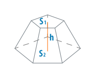

### Задание



Реализуйте класс `Pyramid` (усеченная пирамида), который принимает в конструкторе высоту
пирамиды, а также площади оснований. В классе должен присутствовать метод `getVolume`,
возвращающий объем пирамиды.

### Примеры использования

```
const pyramid = new Pyramid(10, 25, 15);
pyramid.getVolume();    // 197.88
```