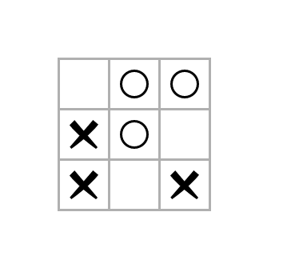

### Задание

Реализуйте верстку игры "Крестики-Нолики", используя `html` и `css`.

### Требования

- Добавьте разметку (`html`) и стили (`css`)
- С помощью тега `` добавьте иконки крестиков и ноликов (иконки лежат в
  директории `./icons`) в произвольном порядке
- Для именования классов необходимо использовать методологию **БЭМ**

### Дополнительно

- Стили для реализации можно выбрать самостоятельно
- Обратите внимание на то, что все границы блоков имеют толщину `2px` (для исключения
  наложения двух границ можно использовать, например, псевдокласс `last-of-type`)

Пример реализации:

