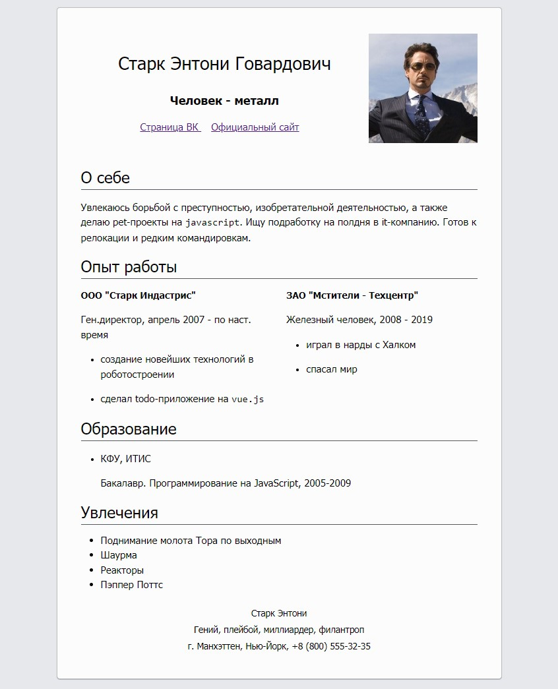

### Задание

Необходимо создать страницу со своим резюме, используя `html` и `css`.

### Требования

- Минимальная комплектация резюме:
    * `header` - шапка (ФИО, контакты, фото(по желанию))
    * `main` - основная часть. Минимальное количество блоков - `5`, например:
        * `"общая информация"`
        * `"о себе"`
        * `"навыки"`
        * `"уровень английского"`
        * `"образование"` и т.д.
    * `footer` - футер страницы (дополнительные контакты, ссылки)
- Используйте семантически правильные конструкции:
    * для элементов списка - теги `ul`, `li`
    * для заголовков - `h1` ... `h6`
    * для выделения параграфов - `p` и т.д.
- Для именования классов необходимо использовать методологию **БЭМ**

### Дополнительно

- Стили для реализации резюме можно выбрать самостоятельно

Пример резюме:

