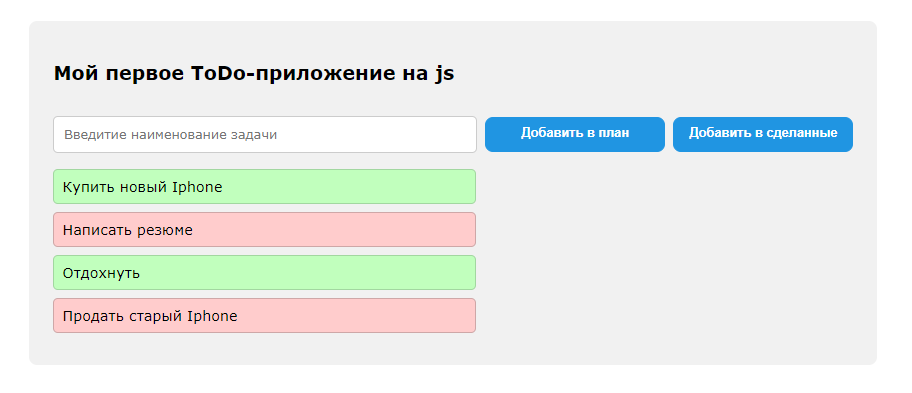

### Задание



Реализуйте простое ToDo-приложение (в функции `setToDo`)

### Исходные данные

Базовый `DOM` имеет следующую структуру

```
<div class="to-do">
    <div class="to-do__header">
        <h2>Мой первое ToDo-приложение на js</h2>
    </div>
    <div class="to-do__main"></div>
    <div class="to-do__tasks"></div>
</div>
```

### Задачи

1. Добавьте в блок `.to-do__main` следующие элементы:

- поле ввода для имени задачи (с классами `form-control`, `form-control-lg`)
- кнопку `Добавить в план` (с классами `btn`, `btn-danger`)
- кнопку `Добавить в сделанные` (с классами `btn`, `btn-success`)

Данный блок должен работать следующим образом:<br>
`1:` Пользователь вводит в поле ввода какой-то текст<br>
`2:` Нажимает на одну из кнопок `Добавить...`<br>
`3:` При клике по кнопке в блок `.to-do__tasks` добавляется (в конец) элемент `span` с
введенным в поле ввода текстом и `data`-атрибутом `type`.<br> При нажатии на
кнопку `Добавить в план` `data-type` будет иметь значение `planned`, при нажатии на
кнопку `Добавить в сделанные` - `completed`.<br>
После добавления новой задачи поле ввода должно очиститься.<br>
Добавление `data`-атрибутов **обязательно**

При клике на какой-либо `span` с задачей эта задача (`span`) удаляется

2. После добавления `5` задач и удаления одной из них `DOM` должен иметь следующую
   структуру:

```
<div class="to-do">
    <div class="to-do__header">
        <h2>Мой первое ToDo-приложение на js</h2>
    </div>
    <div class="to-do__main">
        <input type="text"/>
        <button>Добавить в план</button>
        <button>Добавить в сделанные</button>
    </div>
    <div class="to-do__tasks">
        <span data-type="completed">Купить новый Iphone</span>
        <span data-type="planned">Написать резюме</span>
        <span data-type="planned">Отдохнуть</span>
        <span data-type="completed">Продать старый Iphone</span>
    </div>
</div>
```

### Где посмотреть

1. Для визуального отслеживания изменений необходимо открыть в браузере
   файл `./src/index.html`

### Условия выполнения

1. Все манипуляции выполняются с помощью методов нативного `js` - см. теорию к занятию;
2. Элементы вставляются на страницу с помощью специальных методов, а не строкой;
3. Получение и установка `data`-атрибутов только через `dataset`.

### Дополнительно

1. Изучите работу тега **[input](http://htmlbook.ru/html/input)**