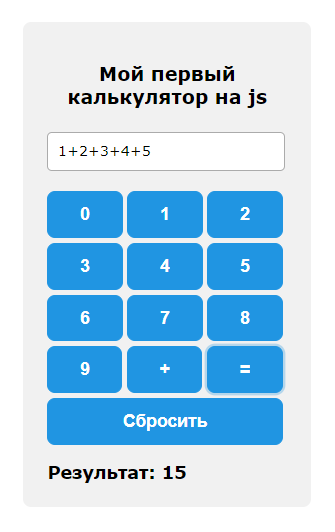

### Задание



Реализуйте простой калькулятор, суммирующий числа (в функции `setCalculator`)

### Исходные данные

Базовый `DOM` имеет следующую структуру:

```
<div class="calc">
    <div class="calc__header">
        <h2>Мой первый калькулятор на js</h2>
    </div>
    <div class="calc__main"></div>
    <div class="calc__buttons"></div>
    <div class="calc__result"></div>
</div>
```

### Задачи

1. В элемент `.calc__buttons` добавить кнопки `0` ... `9`, `+`, `=`, `Сбросить`, назначить
   им классы `btn btn-dark`<br>
   **Порядок кнопок должен быть именно таким**
2. В элемент `.calc__result` добавить два элемента `span`:

- `span` с текстом `Результат: `
- `span` с классом `calc__result-number` и дефолтным содержимым `0`

Логика работы приложения следующая:

1. Пользователь нажимает на кнопки `0` ... `9`, а также на `+`. Набранные знаки
   добавляются в элемент `.calc__main`.
2. При нажатии на кнопку `Сбросить` элемент `.calc__main` должен очиститься, а в
   элемент `.calc__result-number` должно установиться дефолтное значение `0`
3. При нажатии на кнопку `=` программа должны выполнять вычисления (суммировать набранные
   числа) и результат вычисления "класть" в элемент `.calc__result-number`

При наборе "456+3125+43" и последующем нажатии на кнопку `=` `DOM` должен иметь такую
структуру:

```
<div class="calc">
    <div class="calc__header">
        <h2>Мой первый калькулятор на js</h2>
    </div>
    <div class="calc__main">456+3125+43</div>
    <div class="calc__buttons">
        <button data-type="digit" class="btn btn-dark">0</button>
        <button data-type="digit" class="btn btn-dark">1</button>
        <button data-type="digit" class="btn btn-dark">2</button>
        <button data-type="digit" class="btn btn-dark">3</button>
        <button data-type="digit" class="btn btn-dark">4</button>
        <button data-type="digit" class="btn btn-dark">5</button>
        <button data-type="digit" class="btn btn-dark">6</button>
        <button data-type="digit" class="btn btn-dark">7</button>
        <button data-type="digit" class="btn btn-dark">8</button>
        <button data-type="digit" class="btn btn-dark">9</button>
        <button data-type="plus" class="btn btn-dark">+</button>
        <button data-type="result" class="btn btn-dark">=</button>
        <button data-type="reset" class="btn btn-dark">Сбросить</button>
    </div>
    <div class="calc__result">
        <span>Результат:</span>
        <span class="calc__result-number">3624</span>
    </div>
</div>
```

Наличие у элементов `data`-атрибутов **необязательно**. В решении учителя они используются
для реализации "мозгов" приложения. Вы можете использовать свой способ организовать работу
приложения. Для прохождения тестирования важна последовательность кнопок, а также наличие
у элементов оговоренных выше классов

### Условия выполнения

1. Все манипуляции выполняются с помощью методов нативного `js` - см. теорию к занятию;
2. Элементы вставляются на страницу с помощью специальных методов, а не строкой;
3. Получение и установка `data`-атрибутов только через `dataset`.

### Где посмотреть

1. Для визуального отслеживания изменений необходимо открыть в браузере
   файл `./src/index.html`