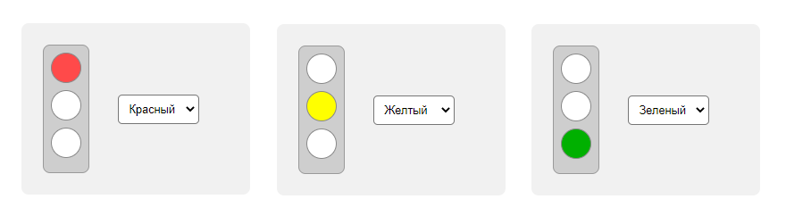

### Задание



Реализуйте светофор (в функции `setTrafficLight`)

### Исходные данные

Базовый `DOM` имеет следующую структуру

```
<div class="traffic">
    <div class="traffic__lights"></div>
    <div class="traffic__lights-select"></div>
</div>
```

### Задачи

1. Добавить в элемент `.traffic__lights` светофор.<br>
   Светофор должен состоять из следующих элементов:

- контейнер с классом `traffic__lights-container`
- в контейнере три элемента `span`, отвечающие за три цвета

2. Добавить в
   элемент `.traffic__lights-select` **[селект](http://htmlbook.ru/html/select)** для
   выбора цвета светофора (c классом `form-select`) <br>
   В селекте три опции - `Красный`, `Желтый`, `Зеленый`.<br>
   Порядок цветов важен!
3. При выборе опции светофор должен "переключаться". Для этого на конкретный `span` надо
   навесить специальный класс:

- `red-light` - для красного
- `yellow-light` - для желтого
- `green-light` - для зеленого

При включении одного из "фонарей" другие должны погаснуть

4. Изначально должен гореть красный "фонарь".

5. После выполнения скрипта и выборе опции "Желтый" `DOM` должен иметь следующую структуру

```
<div class="traffic">
    <div class="traffic__lights">
        <div class="traffic__lights-container">
            <span></span>
            <span class="yellow-light"></span>
            <span></span>
        </div>
    </div>
    <div class="traffic__lights-select">
        <select>
            <option value="red">Красный</option>
            <option value="yellow">Желтый</option>
            <option value="green">Зеленый</option>
        </select>
    </div>
</div>
```

### Условия выполнения

1. Все манипуляции выполняются с помощью методов нативного `js` - см. теорию к занятию;
2. Элементы вставляются на страницу с помощью специальных методов, а не строкой. То есть
   нельзя, например, вставить в элемент `.traffic__lights-select`
   строку `<select></select>`;
3. Для тега `select` используйте событие `change`, а не `click`.

### Где посмотреть

1. Для визуального отслеживания изменений необходимо открыть в браузере
   файл `./src/index.html`

### Дополнительно

1. Все стили в задаче уже определены, но при желании Вы можете переопределить их своими.