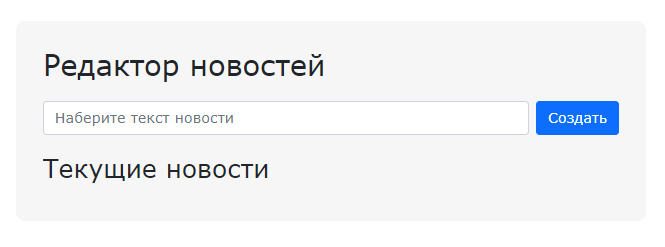
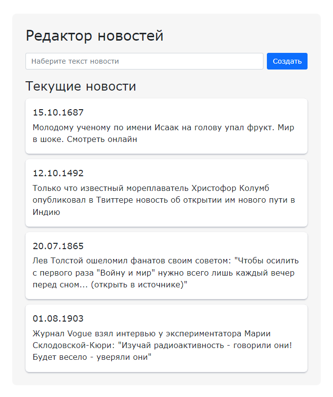

### Задание

В данной задаче необходимо реализовать функцию `setNewsMaker`, определяющую механику
работы новостного редактора.

**Данная задача имеет повышенный уровень сложности, поэтому за ее решение ставится 1
дополнительный балл (в общий зачет семестра)**

**Важно** <br>
Задача отрабатывает навык использования концепции `MVC`. Потратьте время на ее решение и
дальнейший рефакторинг - полученные навыки пригодятся в работе над первым проектом.

### Исходные данные

Базовый `DOM` имеет следующую структуру

```
<div class="main news">
    <div class="news__header">
        <h2>Редактор новостей</h2>
    </div>
    <div class="news__form">
        <input
            class="form-control"
            placeholder="Наберите текст новости"
        />
        <button class="btn btn-primary">
            Создать
        </button>
    </div>
    <h3 class="news__container-header">
        Текущие новости
    </h3>
    <div class="news__container"></div>
</div>
```

### Приложение работает следующим образом

В приложении есть форма для ввода текста новости и кнопка "Создать"



После набора текста новости и нажатия кнопки, в интерфейсе появляется набранная новость.
Пример интерфейса после добавления четырех новостей:



### Механика работы

После набора текста в поле ввода и нажатия на кнопку "Создать" в блок `.news__container`
добавляется (впереди уже добавленных) элемент следующей структуры:

```
<div class="news__news-element">
    <h5>30.05.2022, 15:12:58</h5>
    <div>Текст новости</div>
</div>
```

Здесь в теге `<h5>` находится текущая дата (получение даты см. в подсказках), а в
теге `<div>` - сам текст новости.

Также после добавления новости поле ввода автоматически очищается.

### Где посмотреть

1. Для визуального отслеживания изменений необходимо открыть в браузере
   файл `./src/index.html`

### Условия выполнения

1. Все манипуляции выполняются с помощью методов нативного `js`;
2. **Важно**. Ваше решение должно быть основано на концепции `MVC` - В функции выделено
   общее состояние. Данные для отображения берутся только из него. Слой `Controller`
   отвечает за обновление состояния приложения в ответ на действия пользователя. В решении
   обязательно должны использоваться `watchers` (используйте
   библиотеку **[melanke-watchjs](https://www.npmjs.com/package/melanke-watchjs)**).

### Подсказки

1. Чтобы получить текущую дату, используйте метод `new Date().toLocaleString()`. Более
   подробно о методах работы с датами будет говориться на следующих занятиях