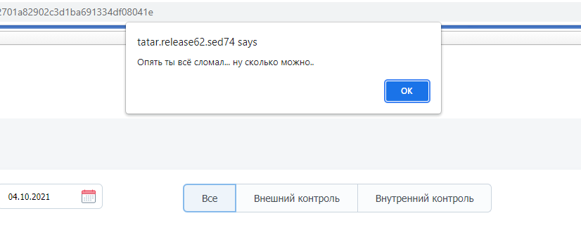

### Асинхронное программирование

Основная часть кода на `JS` **синхронна**. Это значит, что инструкции в коде выполняются
строго последовательно - каждая новая строка выполняется только после выполнения
предыдущей.

Рассмотрим пример с чтением и записью данных в файлы.

Для работы с файловой системой в `JS` предусмотрен специальный
модуль **[fs](https://nodejs.org/api/fs.html)**:

```
1 | import fs from 'fs';
2 |
3 | // Используем синхронные методы (заканчиваются на `sync`)
4 | const fileContent = fs.readFileSync('./files/index', 'utf-8');
5 | fs.writeFileSync('./files/copy-index', fileContent);
```

В данном случае **запись файла (строка `5`) произойдет строго после того, как выполнится
чтение файла (строка `4`)**

Однако на практике мы не можем знать, сколько времени будет производиться чтение файла -
возможно, очень долго. Если в таком случае мы для чтения используем синхронный метод, все
время выполнения операции интерфейс будет недоступен - мы не сможем с ним как-либо
взаимодействовать (нажимать кнопки, вводить текст в форму и т.д.). Подобные "зависания"
неприемлемы в современном "быстром" интернете, где браузер должен почти мгновенно
реагировать на любые действия пользователя.

Для решения этой проблемы в `JS` реализована возможность выполнения **асинхронных
операций**.

#### Как это работает

Асинхронный код вызывается "здесь и сейчас", однако результат его выполнения станет
доступен нам только тогда, когда операция завершится в фоне и
в **[стеке вызовов](https://developer.mozilla.org/ru/docs/Glossary/Call_stack)** не
останется других операций.

Простейшим примером асинхронного кода является "отложенное выполнение операций"

### Отложенное выполнение операций

### setTimeout

Иногда перед разработчиком появляется задача - отложить выполнение кода на определенный
срок. В этом ему может помочь глобально доступный браузерный метод `setTimeout`,
работающий следующим образом:

```
// создаем функцию, выполнение которой хотим отложить
const whereIsTheMoney = (name) => {
    console.log(`Где деньги, ${name}?`);
}

// Вызываем функцию, аргументы следующие
1. наша функция
2. задержка (в миллисекундах)
3+. аргументы нашей функции 
setTimeout(whereIsTheMoney, 1000, 'Лебовски'); // Где деньги, Лебовски?
```

Удалить таймер можно с помощью функции `clearTimeout`:

```
const timerId = setTimeout(whereIsTheMoney, 1000, 'Лебовски');      // получили id таймера
clearTimeout(timerId);                                              // удалили таймер
```

#### setInterval

Имеет аналогичный `setTimeout` интерфейс, запускает переданную функцию с переданной
периодичностью:

```
setInterval(whereIsTheMoney, 1000, 'Лебовски');
// будет выводить "Где деньги, Лебовски?" каждую секунду
```

Для предотвращения "утечки данных" перед завершением работы нашего функционала
необходимо "очистить" наш таймер:

```
const timerId = setInterval(whereIsTheMoney, 1000, 'Лебовски');
clearInterval(timerId);     // очистили таймер
```

***

Рассмотрим простой пример асинхронного кода с использованием `setTimeout`:

```
1 | console.log('Сначала это');
2 | setTimeout(() => {
3 |     console.log('И только потом асинхронный код');
4 | }, 3000);
5 | console.log('А потом это');

// Вывод:
Сначала это
А потом это
И только потом асинхронный код
```

Итак, подробно разберем данный пример. <br>

1. На строке `1` вызывается **синхронный** `console.log`, выводящий в консоль
   текст `Сначала это`
2. Далее на строке `2` вызывается **асинхронный** метод `setTimeout`. Его выполнение
   происходит "на фоне", в то время как движок `JS` продолжает выполнять синхронный код
3. Пока "на фоне" происходит выполнение асинхронной операции, на строке `5` вызывается
   синхронный `console.log`, выводящий в консоль текст `А потом это`
4. После того как "на фоне" завершится выполнение таймаута, отработает код на строке `3` и
   в консоль выведется текст `И только потом асинхронный код`

Благодаря тому, что мы сделали данную операцию асинхронной, во время ее выполнения, мы
можем продолжать взаимодействовать с интерфейсом и он не будет "виснуть"

***

### Event Loop

Для реализации асинхронности используется так называемый **`Event Loop`** (цикл событий).
Это способ организовать последовательность выполнения операций в коде. <br>
Как было сказано выше, при вызове асинхронной функции синхронный код продолжает
выполняться, а асинхронная операция выполняется на фоне (в браузерном `API`). Когда она
наконец выполнится, ее результат будет передан в коллбэк (функцию-обработчик), который
будет положен в очередь выполнения других таких же асинхронных коллбэков. Подробно
об `Event Loop` можно узнать в отличном видео
от `Philip Roberts` **[- ссылка](https://www.youtube.com/watch?v=8aGhZQkoFbQ)**

***

Асинхронный код можно реализовать следующими способами:

### 1. Код на коллбэках

В данном варианте результат выполнения асинхронной операции обрабатывается в специальной
функции - **коллбэке**

```
import fs from 'fs';

const callbackFunction = (error, data) => {
    // some code

    // error - ошибка, полученная при выполнении чтения файла
    console.log(error);

    // data - результат выполнения операции (содержимое файла в данном случае)
    console.log(data)
};

fs.readFile('./files/index', 'utf-8', callbackFunction);
```

Обратите внимание, что вызов `fs.readFile` ничего не возвращает:

```
const data = fs.readFile('./files/index', 'utf-8', callbackFunc);
console.log(data); // undefined
```

Для того чтобы использовать результат выполнения метода `readFile`, нам необходимо
определить его в переданном коллбэке. Рассмотрим пример с выводом в консоль содержимого
трех файлов:

```
import fs from 'fs';

fs.readFile('./files/one', 'utf-8', (errorOne, dataOne) => {
    fs.readFile('./files/two', 'utf-8', (errorTwo, dataTwo) => {
        fs.readFile('./files/three', 'utf-8', (errorThree, dataThree) => {
            console.log(`${dataOne}${dataTwo}${dataThree}`);
        });
    });
});
```

Здесь несложно заметить, что с ростом количества операций сложность кода резко
возрастает (код растет вширь и разбираться в нем становится крайне проблематично).
Используя такой подход, очень легко превратить свой код
в **[Ад коллбэков](http://callbackhell.com/)**

#### Параллельное выполнение операций

Иногда перед разработчиком появляется задача выполнить какой-то код строго после
выполнения каких-то асинхронных операций, причем последовательность выполнения не важна.
Для этого можно реализовать следующую структуру:

```
const state = [];

const logContent = () => {
    if (state.length !== 2) {
        return; // если добавлен только один файл, то выходим из функции
    }
    
    const text = state.join(', ');
    console.log(text);
};


// Читаем первый файл, добавляем его содержимое в data
fs.readFile('./app/one', 'utf-8', (error, data) => {
    state.push(data);
    
    // Пытаемся вывести данные в консоль.
    // Если другой файл уже обработан, значит выполнение
    // всех асинхронных операций завершено
    logContent();
});

// Читаем второй файл, добавляем его содержимое в data
fs.readFile('./app/two', 'utf-8', (error, data) => {
    state.push(data);
    
    // пытаемся вывести данные в консоль
    logContent();
});
```

В данном случае асинхронные операции чтения файлов выполняются "на фоне" параллельно,
поэтому нам не нужно дожидаться выполнения одной для начала выполнения другой.

Также данный кейс можно реализовать и с помощью различных библиотек,
например **[async](https://caolan.github.io/async/v3/)**

***

### 2. Код на промисах

Очевидно, что код на коллбэках очень сложен и его очень легко сделать нечитаемым (а значит
именно таким его и сделают программисты). Следующим этапом развития асинхронности в `JS`
стали промисы (`promise`). Промисы позволяют сделать код более читаемым, "плоским".

`Promise` - специальный объект-обещание, который вызывается сейчас, а выполнится когда-то
в будущем. <br>

Работа с промисами отличается от работы с коллбэками тем, что результат выполнения
асинхронной операции мы получаем в секции `then`, следующей за вызовом асинхронного
метода. В секцию `then` нам нужно передать функцию, которая будет принимать в качестве
аргумента результат выполнения операции.

Рассмотрим простой пример с чтением файлов:

```
const { promises } = fs;

promises
    .readFile('./files/one', 'utf-8')
    .then((dataOne) => {
        console.log(dataOne);
    })
```

Теперь давайте разберемся с тем, как промис устроен.

Создать простейший промис можно с помощью конструктора `new Promise`:

```
const bestPromiseEver = new Promise((resolveCallback, rejectCallback) => {
    // Внутри переданной функции можно выполнять асинхронные операции
    
    // Аргументами функции являются функции resolveCallback и rejectCallback
    // resolveCallback(result)  - будет вызван при успешном выполнении асинхронной операции
    // rejectCallback(error)    - будет вызван при ошибке в асинхронной операции
})
```

В случае работы с коллбэками сама функция возвращала `undefined`. Что же вернет
вызов `promises.readFile('./files/one', 'utf-8')`?

```
const promise = fsp.readFile('./files/one', 'utf-8');
console.log(promise);
// Promise { <pending> }
```

**Из промиса всегда возвращается другой промис** <br>
Также здесь мы видим и текущее состояние промиса - `pending` - "выполняется"

Чтобы использовать результат выполнения асинхронной операции, нам на нашем промисе нужно
вызвать метод `then`:

```
bestPromiseEver.then(onFulfilled, onRejected)
```

Здесь:

- `onFulfilled` - функция, обрабатывающая положительный результат. В нее попадет именно
  то, что мы положили в функцию `resolveCallback` внутри самого промиса;
- `onRejected` - функция, обрабатывающая отрицательный результат. В нее попадет именно то,
  что мы положили в функцию `rejectCallback` внутри самого промиса.

Приведем пример:

```
promises
    .readFile('./files/one', 'utf-8')
    .then(
        // Функция onFulfilled:
        (result) => {
            console.log(result);
        },
        // Функция onRejected:
        (error) => {
            console.log(error);
        }
    )
```

После того как промис выполнился, его состояние изменилось на `fulfilled` при
положительном результате и на `rejected` при отрицательном. После этого поменять состояние
уже нельзя.

Благодаря тому, что из промиса всегда возвращается другой промис, мы можем соединять
несколько асинхронных операций в цепочку промисов, четко определяя последовательность
выполнения операций. Рассмотрим пример:

```
const { promises } = fs;

promises.readFile('./files/one', 'utf-8')                       // Запрашиваем данные из первого файла 
    .then((dataOne) => console.log(dataOne))                    // Получаем данные из первого файла (внутри then)
    .then(() => promises.readFile('./files/two', 'utf-8'))      // Запрашиваем данные из второго файла в новом промисе 
    .then((dataTwo) => console.log(dataTwo))                    // Получаем данные из второго файла (внутри then)
    .then(() => promises.readFile('./files/three', 'utf-8'))    // etc
    .then((dataThree) => console.log(dataThree));
```

При последовательных вызовах `.then`, в каждый следующий `then` переходит результат от
предыдущего. Если очередной `then` вернул промис, то далее по цепочке будет передан не сам
этот промис, а его результат.

***

#### Обработка ошибок в промисах

Как мы уже знаем, обработка данных в промисах последовательна и использует
цепочку `.then(...`. В случае возникновения ошибки мы можем "отловить" ее во второй
функции, переданной в секцию `then`:

```
// Речь о методе "onRejected"
bestPromiseEver.then(onFulfilled, onRejected)
```

Однако есть и более удобный способ - секция `catch`, выполняющая ту же роль, но
принимающая единственный аргумент - функцию обработки ошибки. Чаще всего код на промисах
пишется именно в виде пары `then + catch` - в секции `then` мы обрабатываем положительный
результат, в секции `catch` - отрицательный.

Также есть специальный метод для отработки в случае выполнения промиса (неважно, с каким
результатом) - метод `finally`.

Разберем пример:

```
bestPromiseEver
    .then((data) => {
        // как-то используем полученные данные
    })
    .catch((error) => {
        // Обрабатываем ошибку
        console.error(error);
    })
    .finally(() => {
        // Выполняем код вне зависимости от успешности выполнения запроса
        alert('точно выполнится');
    });
```

Операции в цепочке промисов выполняются последовательно. В момент появления ошибки
прекращается выполнения всех последующих `then` до ближайшего `catch`, куда данная ошибка
и попадает. После "отлова" ошибки можно продолжить цепочку для дальнейшего выполнения
операций

```
1. promises.readFile('./files/one', 'utf-8')
2.     .then((dataOne) => console.log(dataOne))
3.     .then(() => promises.readFile('./files/two', 'utf-8'))
4.     .then((dataTwo) => console.log(dataTwo))
5.     .catch((error) => console.log(error))
6.     .then(() => promises.readFile('./files/three', 'utf-8'))
7.     .then((dataThree) => console.log(dataThree));
```

Если на строке `1` произойдет ошибка, строки `2`, `3` и `4` не выполнятся. Ошибка попадет
на строку `5`, где выведется в консоль. После этого отработает строка `6` и так далее

#### Promise.all - параллельные операции на промисах

Для того чтобы выполнить несколько операций параллельно, используется метод `Promise.all`

```
const promiseOne = <создаем промис>;
const promiseTwo = <создаем еще промис>;

// Передаем в качестве аргументов массив промисов, которые мы хотим запустить параллельно
const promise = Promise.all([promiseOne, promiseTwo]);

// Здесь в аргументе then получаем массив результатов переданных промисов
// Дальше можем использовать полученный промис как обычный
promise.then(([dataOne, dataTwo]) => console.log(`${dataOne}${dataTwo}`));
```

#### Промисификация

В ряде случаев требуется преобразовать код на коллбэках в промисы. Для этого используется
конструкция `new Promise`

"Промисификация" выглядит следующим образом:

```
const newPromise = new Promise((resolve, reject) => {
    // resolve - коллбэк, вызываемый при успешком выполнении операции
    // reject - коллбэк, вызываемый при появлении ошибок в процессе выполнения операции
    fs.readdir('./files/one', (error data) => {
        if (error) {
            reject(error);
            return;
        }
        resolve(data);
    });
});
```

Далее наш промис можно использовать как любой другой промис (через `then` и `catch`)

Существуют также **[специальные библиотеки](https://noteskeeper.ru/heritage/1332/)** для
промисификации.

Для создания промисов существуют также методы:

```
const promiseOne = Promise.resolve();  // промис, который завершится с успехом
// promiseOne.then((data) => ...

const promiseTwo = Promise.reject();   // промис, который завершится с неудачей
// promiseTwo.catch((error) => ...
```

### Отлов ошибок в асинхронном коде

Почти в любом асинхронном коде могут возникнуть какие-либо ошибки. Задача разработчика -
грамотно обработать их. Для этого в `JS` предусмотрено несколько синтаксических
конструкций:

#### try/catch/finally

`try/catch/finally` - способ "отловить" ошибку в коде. Работает следующим образом:

```
try {
    // выполняем код
    const data = testData; // здесь выполнение остановится из-за ошибки
    const newData = data.names; // не выполнится
} catch (error) {
    // ловим ошибку, обрабатываем ее
    console.log(error);
} finally {
    // выполняем что-то (выполнится в любом случае)
    this.filter = { ...data };
}
```

Данная конструкция очень напоминает `.then().catch().finally()`, но может работать только
с синхронными операциями (исключение `async/await` - теория следующего занятия).

Ошибку можно "выбросить" в код самостоятельно, для этого используется ключевое
слово `throw`. Сами ошибки можно создавать самостоятельно:

```
const error = new Error('Текст ошибки');            // Общий тип ошибок
const error = new SyntaxError('Текст ошибки');      // Синтаксические ошибки
const error = new ReferenceError('Текст ошибки');   // Ошибки, возникающие при обращении к несуществующей переменной
const error = new TypeError('Текст ошибки');        // Ошибка типа

try {
    const data = { keys: [ 1, 2, 3 ] };
    if (!data.names) {
        throw new Error("Имена не найдены");
    }
    const newData = data.names; // не выполнится, выполнение перейдет в блок `catch`
} catch (error) {
    console.log(error);
    throw error; // "выбрасываем" ошибку для дальнейшего использования
}
```

О структуре самих ошибок можно
почитать **[тут](https://developer.mozilla.org/ru/docs/Web/JavaScript/Reference/Global_Objects/Error)**

### Вывод ошибок в ui

Для вывода ошибок пользователю существует встроенный в `JS` метод `alert`:



Однако он обладает примитивным, не кастомизируемым внешним видом, поэтому чаще всего
разработчик сам настраивает специальные элементы для вывода ошибки в интерфейс. Это может
быть кастомное модальное окно, какое-либо всплывающее уведомление и т.д.

