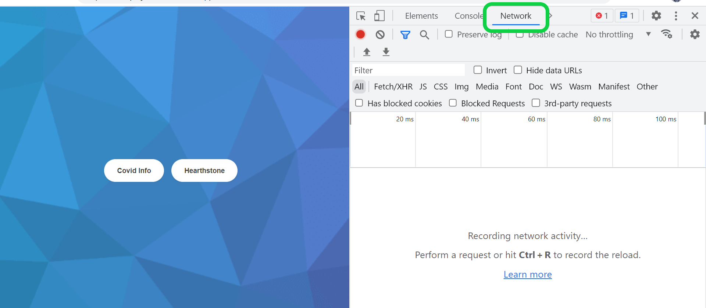

### Async/await

Наиболее продвинутым способом работы с асинхронным кодом является
конструкция **[async/await](https://developer.mozilla.org/ru/docs/Web/JavaScript/Reference/Statements/async_function)**

Основное преимущество - возможность работать с асинхронным кодом, как с синхронным. <br>

Здесь важно отметить, что внутри `async/await` работают все на тех же промисах.

Определение асинхронной функции:

```
import { promises } from 'fs';

// Используем ключевое слово async для определения функции
const getContent = async () => {

    // Для выполнения какого-то промиса используется ключевое
    // слово await (его можно использовать только внутри async–функций)
    const firstFileData = await promises.readFile('./files/one', 'utf-8');
    
    // Здесь происходит следующее: при обработке этой строки
    // движок JavaScript будет ждать выполнения промиса, после чего результат
    // выполнения промиса положит в переменную
    
    const secondFileData = await promises.readFile('./files/two', 'utf-8');
    
    return `${firstFileData}${secondFileData}`;
}
```

В данном случае `await`-операции выполнятся строго последовательно (как по цепочке
промисов). <br>

Функция `getContent` возвращает промис, который можно использовать через `then` (или в
другой `async`-функции):

```
getContent().then((content) => {
    console.log(content);
})
```

Данный пример аналогичен следующему коду на промисах:

```
const getContent = () => {
    return promises.readFile('./files/one', 'utf-8')
        .then((firstFileData) => promises.readFile('./files/two', 'utf-8')
            .then((secondFileData) => `${firstFileData}${secondFileData}`))
}

getContent().then((content) => {
    console.log(content);
})
```

Для параллельной работы кода с `async/await` используется все тот же `Promise.all`

***

### Обработка ошибок в async/await

Обработка ошибок в `async/await` довольно сильно напоминает собой вариант обработки ошибок
в промисах, так как использует синтаксис `try/catch/finally`.

Так как код на `async/await` выглядит как синхронный, логика работы конструкции аналогична
той, что была описана на предыдущем занятии:

```
try {
    // Выполняем асинхронную операцию
    const data = await getTemplateData(id);

    if (!data) {
        // при необходимости "выбрасываем" ошибку в блок `catch`
        throw errors;
    }

    // выполняем какую-то логику, если асинхронная операция завершилась удачно
    console.log(data);
} catch (error) {
    // обрабатываем ошибку
    // сюда может попасть как ошибка выполнения самой асинхронной операции (в методе getTemplateData),
    // так и вручную "выброшенная" ошибка (throw errors)
    console.error(error);
} finally {
    closeLoader();
}
```

***

### Ajax в JS. Fetch

Один из наиболее частых примеров асинхронного программирования на клиентской части
приложения - выполнение сетевого запроса.

`AJAX` - `Asynchronous JavaScript And XML`. Система выполнения сетевых запросов. <br>
В `JS` есть несколько способов отправить `ajax`-запрос:

1. Встроенный метод `fetch`

`Fetch` - промис, который можно обработать через `then/catch` и через `async/await`. <br>
Синтаксис следующий:

```
// можно вызвать и без второго аргумента. В таком случае отправится
// обычный get-запрос на получение данных по переданному url
fetch(url, {
    method: 'POST',
    headers: {
        'Content-Type': 'application/json',
        'X-Requested-With': 'XMLHttpRequest',
    },
    body,
})
    .then((response) => response.json())    // обработка результата запрос
    .catch((error) => {                     // обработка ошибок
        console.error(error);
    });
    
// или

const response = await fetch(url);
const result = await response.json();
```

При обработке ответа можно использовать несколько методов:

- `response.text()` – возвращает ответ в виде обычного текста,
- `response.json()` – декодирует ответ в формате JSON,
- `response.formData()` – возвращает ответ как объект FormData,
- `response.blob()` – возвращает объект как Blob (бинарные данные),
- `response.arrayBuffer()` – возвращает ответ как ArrayBuffer (низкоуровневое
  представление бинарных данных).

Также есть следующие параметры ответа:

- `response.status` – HTTP-код ответа,
- `response.ok` – true, если статус ответа в диапазоне 200-299.
- `response.headers` – похожий на Map объект с HTTP-заголовками.

2. `Axios`

**[Axios](https://axios-http.com/)** - `http`-клиент для работы в браузере и `node.js`.

Данная библиотека предоставляет удобный интерфейс для работы с `http`-запросами. Работает
на промисах.

```
// get-запрос
axios.get('/getorgs.php', {
        params: {
            fio: 'Что-то написано',
            type: 'json'
        }
    })
    .then((response) => {
        console.log(response);
    })
    .catch((error) => {
        console.log(error);
    });
    
// post-запрос
axios.post('/user', {
        firstName: 'Elon',
        lastName: 'Musk'
    })
    .then((response) => {
        console.log(response);
    })
    .catch((error) => {
        console.log(error);
    });
```

3. `XMLHttpRequest`

Несколько "устаревший" **[метод](https://learn.javascript.ru/xmlhttprequest)**
отправки `http`-запросов (в задачах и проектах использовать этот метод не будем)

***

### Где я могу посмотреть, что я отправил на сервер?

Для отладки сетевых запросов в браузере присутствует весьма удобный способ - "инструменты
разработчика" - вкладка `Network`.



Здесь после отправки запроса мы можем отслеживать следующие данные:

- отправленные данные
- код ответа
- полученные данные
- заголовки отправленного запроса
- заголовки полученного ответа
- время выполнения запроса
- многое другое

Здесь же можно изменить настройки скорости интернета (выпадающий список `No throttling`)

Зайдите в **[пример к первому проекту](https://js-course-project-1-t8ib.vercel.app/)** и
понажимайте кнопки виджетов - во вкладке `Network` проследите данные отправки запросов.

***

### Другие способы отправки данных на сервер

Данные на сервер могут попасть и другим образом - например, при отправке формы.

Работает этот метод следующим образом:

В разметке страницы присутствует некоторая форма - тег `<form>`:

```
1. | <form>
2. |     <input type="checkbox" name="create_xml"> создать XML файлы
3. |     <input type="hidden" name="user_id" value="8812920">
4. |     <input type="submit" value="Отправить">
5. | </form>
```

В момент нажатия на кнопку `Отправить` происходит отправка формы на сервер. Данные
передаются с помощью тегов `<input>`, причем они могут быть явными (например, чекбокс на
строке `2`) и скрытыми (например, поле на строке `3`). На сервер данные попадают в виде
массива пар `ключ: значение`, где:

- `ключ` - значение атрибута `name` в теге `<input>`
- `значение` - значение атрибута `value` для скрытых тегов `<input>` и состояние самого
  тега, если он виден (в случае с чекбоксом - `true/false`)

Более подробно можно ознакомиться с формами **[здесь](http://htmlbook.ru/html/form)**

***

### Выделение `api` в отдельный модуль

При работе с `http`-запросами выгодно выделить все методы в специальный файл (`api`),
отвечающий за логику отправки запросов на сервер организации и на сторонние сервера.

Пример: <br>
файл `api.js`, где мы определяем наш модуль работы с запросами:

```
// Пример из реального проекта
import qs from 'qs';

const fetchWrapper = (url, data, config = {}) => {
    const config = { /* какой-то код */ };
    const url = /* какой-то url */;

    return fetch(url, config)                       // отправляем запрос
        .then((response) => response.json())        // ответ передаем в формате json
        .catch((error) => {
            console.error('Ошибка:', error);        // выводим в консоль ошибки
            throw error;                            // "выбрасываем" ошибку для дальнейшего его использования
        });
};

const api = {
    fetchReportData(data) {
        return fetchWrapper(<some url>, data, { method: 'POST' });
    },
    saveTemplates(data) {
        return fetchWrapper(<some url>, data, { method: 'POST' });
    },
    deleteTemplate(data) {
        return fetchWrapper(<some url>, data, { method: 'POST' });
    },
};

export default api;
```

Использование в другом файле:

```
import api from '@api/index';

// какой-то код

const getTemplates = () => {
    api.saveTemplates({ templates: [ /* что-то */ ] })
        .then((data) => {
            // какой-то код
        })
        .catch((error) => {
            console.error(error);
            // какой-то код
        });
};

// какой-то код
```

**Почему это важно**

Выделение логики отправки запросов в отдельный модуль - пример отличной **абстракции**.
Родительский код для отправки запроса использует декларативный метод `api.saveTemplates`.
Ему (родительскому коду) абсолютно неважно, как именно "внутри" происходит отправка
запроса, какие заголовки в нем передаются и т.д. Точно так же дочерний код (код самого
модуля, где мы описываем логику отправки запроса) ничего не знает о том, откуда приходят
данные и какие используется результат его (модуля) работы. Под "не знает" подразумевается
то, что мы никак не связываем в коде родительский код и дочерний. Сделать это можно очень
просто - передать внутрь модуля какие-то данные из родительского кода, а затем внутри
произвести какие-то манипуляции над ними. Разберем пример:

На этот раз реализуем модуль `api` следующим образом:

```
1 | const api = {
2 |     fetchReportData(data, selector) {
3 |         const container = document.querySelector(selector);
4 |         container.dataset.id = data.id;
5 |         return fetchWrapper(<some url>, data, { method: 'POST' });
6 |     },
7 | };
8 | export default api;
```

Обратите внимание - здесь мы в сигнатуру метода `fetchReportData` передаем не только
данные, необходимые для отправки запроса, но и селектор, для того, чтобы на `3` найти по
нему элемент и на строке `4` как-то этот элемент изменить.

То есть наш модуль "знает" о существовании каких-то селекторов (из родительского кода) и
внутри себя с этими селекторами работает. Пример синтетический, но суть проблемы передает.

К тому же здесь мы получаем еще одну проблему - наш модуль больше не отвечает за какую-то
одну операцию - он отправляет запросы и мутирует `DOM`-дерево. Таким образом, **принцип
единой ответственности** здесь тоже не применяется.

При несоблюдении **принципа единой ответственности** мы получаем более сложный для
анализа, расширения и рефакторинга код. При любых манипуляциях нам придется как-то
увязывать между собой код, отвечающий за ту, и за другую задачи. При такой архитектуре
сложнее найти баг в коде и сложнее грамотно его починить.

Поэтому при создании какого-либо модуля стоит спросить себя "А что он делает?", и если в
ответе мы услышим союз "и" (например, "отправляет запросы **и** мутирует DOM"), надо
реструктурировать код.