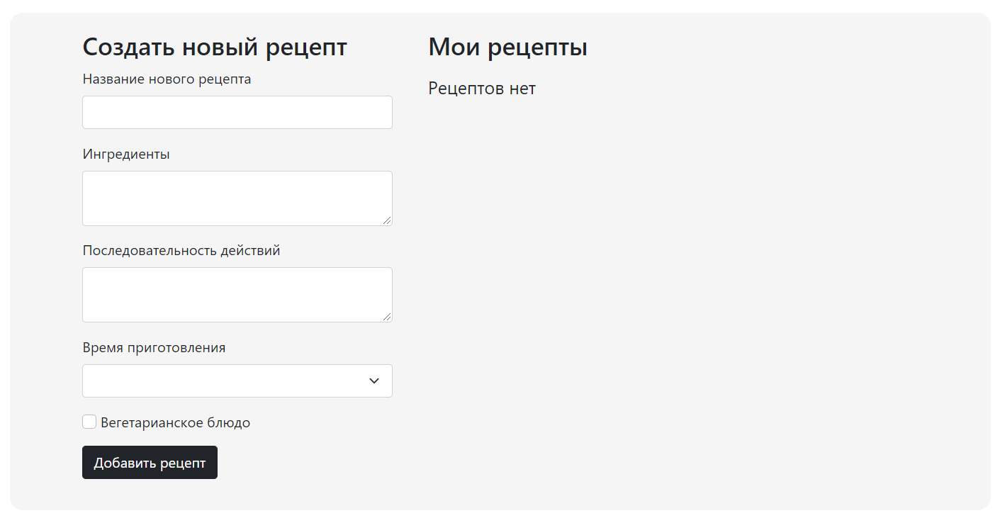
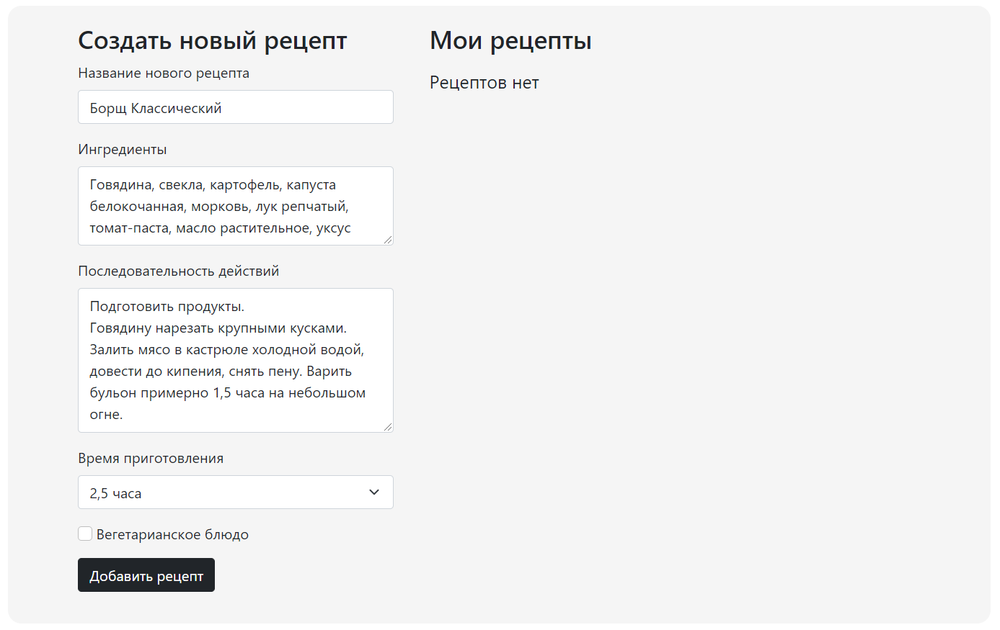
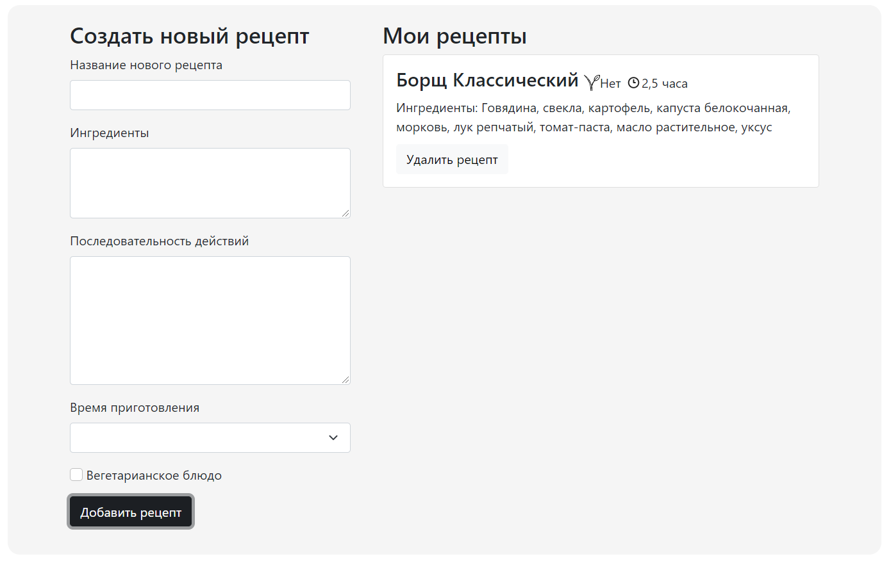
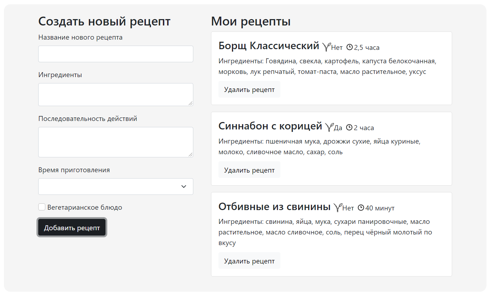

### Задание

В данном задании необходимо реализовать приложение для формирования рецептов.

**Данная задача имеет повышенный уровень сложности, поэтому за ее решение ставится 1
дополнительный балл (в общий зачет семестра)**

### Задачи

Бизнес-логика следующая:

1. Слева присутствует блок для формирования нового рецепта.



2. Заполняем поля произвольным образом.



3. Нажимаем "Добавить рецепт" - рецепт добавляется в правый блок, поля очищаются.



5. Добавляем другие рецепты / удаляем уже добавленные.



6. Приложение состоит из двух колонок:
    * Блока добавления нового рецепта (слева). Здесь есть следующие поля:
        * Название нового рецепта - `input`
        * Ингредиенты - `textarea`
        * Последовательность действий - `textarea`
        * Время приготовления - `seleсt` (дефолтное значение - `5минут`)
        * "Вегетарианское блюдо" - `input type=checkbox` (дефолтное значение - `false`)
        * Кнопка "Добавить рецепт". При нажатии на нее в правую колонку добавляется новый
          рецепт (в конец списка), все поля формы очищаются
    * Блока с добавленными рецептами (справа). Здесь представлен массив из добавленных
      рецептов. Если рецептов нет, выводится текст "Рецептов нет". Каждый блок рецепта
      содержит следующую информацию:
        * Название
        * "Вегетарианское блюдо" - иконка `VeganIcon` и текст `Да/Нет`
        * Время приготовления - иконка `TimeIcon` и, например, "30 минут"
        * Ингредиенты - текстовый элемент
        * Кнопка "Удалить рецепт". При нажатии на нее текущий рецепт должен удаляться


7. В определенный момент времени `html` может иметь следующую структуру (классы должны
   совпадать, так как в данном задании производится тестирование с помощью `snapshots`):

```
<div class="recipes">
    <div class="recipe-form">
        <h3>
            Создать новый рецепт
        </h3>
        <div class="recipe-form__block">
            <label class="form-label">
                Название нового рецепта
            </label>
            <input
                type="text"
                class="form-control recipe-form__name"
            >
        </div>
        <div class="recipe-form__block">
            <label class="form-label">
                Ингредиенты
            </label>
            <textarea class="form-control recipe-form__ingredients"></textarea>
        </div>
        <div class="recipe-form__block">
            <label class="form-label">
                Последовательность действий
            </label>
            <textarea class="form-control recipe-form__recipe-text"></textarea>
        </div>
        <div class="recipe-form__block"><label class="form-label">
            Время приготовления
        </label>
            <select class="form-select recipe-form__cook-time">
                <option value="1">
                    5 минут
                </option>
                <!-- другие опции -->
            </select>
        </div>
        <div class="recipe-form__block">
            <input
                type="checkbox"
                class="form-check-input"
            >
            <label class="form-check-label">
                Вегетарианское блюдо
            </label>
        </div>
        <div class="recipe-form__block">
            <button class="btn btn-dark recipe-form__add-button">
                Добавить рецепт
            </button>
        </div>
    </div>
    <div class="recipe-container">
        <h3>
            Мои рецепты
        </h3>
        <div class="card">
            <div class="card-body">
                <div class="card-body__header">
                    <h4>
                        Отбивные из свинины
                    </h4>
                    <svg> <!-- иконка VeganIcon --> </svg>
                    Нет
                    <svg> <!-- иконка TimeIcon --> </svg>
                    40 минут
                </div>
                Ингредиенты:
                свинина, яйца, мука
                <button class="btn btn-light card-body__remove-button">
                    Удалить рецепт
                </button>
            </div>
        </div>
        <!-- Нижерасположенный div выводится в случае, если рецептов нет
        <div class="recipe-container__no-recipes">
            Рецептов нет
        </div>
    </div>
</div>
```

Реализуйте логику работы компонента `Recipe.vue`, импортируйте в нем два других
компонента:

- `./components/NewRecipeForm.vue` - компонент для формы добавления рецепта
- `./components/RecipesContainer.vue` - компонент для отображения массива рецептов в
  правом блоке. В данном компоненте используйте `VeganIcon`  и `TimeIcon`

### Где и как посмотреть

1. Из корня проекта запускаем сборку `vue` через `webpack` - `yarn watch`
2. Для визуального отслеживания изменений необходимо открыть в браузере
   файл `./index.html`