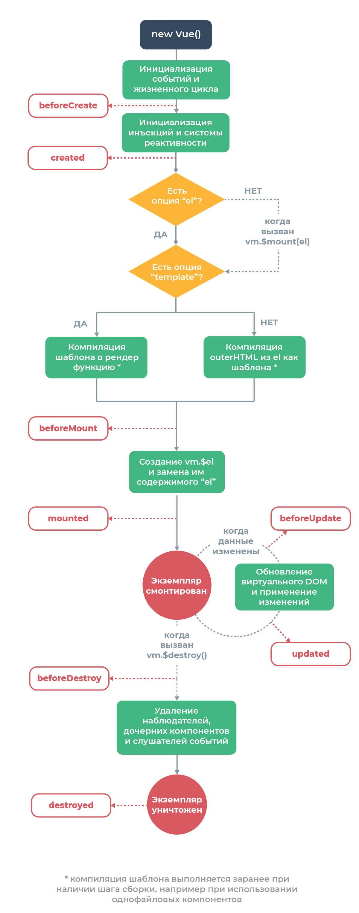

### 1. Почему data - функция, а не объект

Если в экземпляре `vue` ключ `data` реализовать в виде объекта, в консоли появится
следующая ошибка:
> [Vue warn]: The "data" option should be a function
> that returns a per-instance value in component definitions.

Об этом же нам скажет, например, `Webstorm`. <br>
Это связано с тем, что каждый компонент может использоваться множество раз, а `data` -
локальное хранилище данных в этом компоненте. И когда `data` - это простой объект, любые
его мутации в конкретных экземплярах приведут к изменению данных во всех остальных
экземплярах (ведь объект в `JS` передается по ссылке). <br>
Корректными же вариантами будут:

```
data() {
    text: ''
}

// или

data: () => ({
    text: ''
})
```

***

### 2. Реактивность Vue

Нативный `JS` - очень мощная вещь, однако "из коробки" в нем мало что предусмотрено для
удобной работы с `DOM`. При каком-либо обновлении состояния приложения мы вынуждены
вручную обновлять `DOM`-дерево, что в итоге может быть очень затратно с точки зрения
времени на выполнение задач.

`Vue` решает эту проблему внедрением реактивности в работу компонентов

Рассмотрим пример:

```
<template>
    <input type="text" v-model="name" />
    <input type="text" v-model="number" />
</template>

<script>
export default {
    data() {
        return {
            name: 'Kimi',
            number: 42,
        };
    },
};
</script>
```

В момент инициализации приложения `vue` реактивно связывает данные приложения и элементы
на странице (в данном случае `name` и `number`). Теперь при изменениях состояния
автоматически будет обновляться и `view` приложения. И наоборот, при обновлении `view` (в
данном случае через `v-model`) будет обновляться состояние компонента.

Документация по `vue` гласит:

> Когда простой JavaScript-объект передаётся в экземпляр Vue в качестве опции data,
> Vue обходит все его поля и превращает их в пары геттер/сеттер, используя
> Object.defineProperty. Эта возможность появилась в JavaScript только в версии ES5,
> поэтому в более ранних версиях её эмулировать не получится — по этой-то причине Vue
> и не поддерживает IE8 и ниже.

> В каждый экземпляр компонента добавлен связанный с ним экземпляр наблюдателя,
> который помечает все поля, затронутые при отрисовке компонента как зависимости.
> В дальнейшем, когда вызывается сеттер поля, помеченного как зависимость, этот сеттер
> уведомляет наблюдателя, который, в свою очередь, инициирует
> повторную отрисовку компонента.


Так как реактивность настраивается в момент инициализации приложения, свойства объектов,
добавленные впоследствии, не будут реактивными:

```
const vm = new Vue({
    data: {
        name: 'Elon'
    }
})
vm.name — реактивное поле

vm.text = 'some text';
vm.text — не реактивное поле
```

Для обхода этого момента имеется встроенный метод `set`, обеспечивающий реактивность для
нового свойства:

```
Vue.set(vm, 'text', 'some text');

// метод для работы в экземпляре компонента
this.$set(this, 'text', 'some text');
```

В случае с массивами `vue` не может отследить прямую установку элемента по индексу
массива (`vm.elements[index] = newValue`). Решение проблемы следующее:

```
// Использование Vue.set
Vue.set(vm.elements, index, newValue);

// Использование this.$set
this.$set(this.elements, index, newValue)

// Использование Array.prototype.splice
this.elements.splice(index, 1, newValue);
```

***

### 3. Принцип MVVM и vue

Разработчики `vue` причисляют свой продукт к реализациям принципа
`MVVM` - `Model View ViewModel`


В данном случае сам `Vue` является `ViewModel`-частью концепции, определяя способ
синхронизации слоя данных (`Model`) и слоя представления (`View`). <br>
`Vue` реактивно связывает модель и слой представления, благодаря чему мы (разработчики)
можем обновлять состояние и знать, что слой представления обновится автоматически, и
наоборот, что при обновлении слоя представления (например, через `v-model`) автоматически
обновится слой данных.
***

### 4. Принцип MVC и vue

Разработку приложения на `JS` можно строить на концепции `MVC`. В таком случае мы получаем
четкую структуру с единым источником правды и грамотным разделением логики функционала.

Хоть сами разработчики `Vue` ничего не говорят об использовании этой концепции в работе
своего фреймворка, этот подход все же имеет место быть, когда речь заходит о принципах
работы компонентов фреймворка. <br>
Так, слоем `Model` здесь служит функция `data`, определяющая **состояние**
компонента. <br>
Слоем `View` служит шаблон (`template`), определяющий **внешний вид**. <br>
И наконец слоем `Controller` служат **методы**, обновляющие состояние приложения в ответ
на действия пользователя в слое `View` (например, клики).

**Важно заметить**, что на деле концепция `MVC` реализуется во `Vue` лишь частично и
только под определенным ракурсом, ведь `Vue` предоставляет возможность обновлять состояние
из слоя `View`, а также из слоя `Controller` (в случае с `computed`-свойствами). Здесь
важно обратить внимание на то, что единым источником правды в компоненте все еще является
слой `model` (`computed`-свойства берут данные именно оттуда)
***

### 5. Virtual DOM

**Вопросу оптимизации** во фреймворках выделяется особое внимание, так как перерисовка
элементов `DOM`-дерева довольно трудоемкая задача. <br>
Во `vue` для этого используется так называемый **виртуальный `DOM`**.


При каждом обновлении состояния `vue` создает виртуальное `DOM`-дерево, сравнивает его с
текущим деревом на странице и точечно обновляет элементы. В результате мы избегаем
необходимости обновлять весь `DOM` при любых обновлениях состояния.
***

### 6. Создание дерева компонентов и передача данных от детей к родителям и наоборот

Компонентный подход позволяет интуитивно понятно выстраивать сложную архитектуру
приложения. Компоненты могут вкладываться друг в друга, выстраивая таким образом
древовидную структуру зависимостей (почти как в `DOM`).

Чтобы вложить один компонент в другой, необходимо в секции `script` произвести импорт и
описать импортированный компонент в секции `components`:

```
<script>
import Child from './Child.vue';

export default {
    name: 'ParentComponent',
    components: { Child },
    data() {
    ...
```

В самом дочернем компоненте производить экспорт не нужно.

В дереве компонентов есть корневой компонент, от которого это дерево и начинается. Доступ
к нему можно получить из любого дочернего компонента, используя метод `this.$root`:

Корневой компонент:

```
<script>
export default {
    name: 'ParentComponent',
    data() {
        return {
            name: 'Alex'
        }
    }
    ...
</script>
```

Дочерний компонент:

```
<script>
export default {
    name: 'Child',
    methods: {
        saveData() {
            const name = this.$root.name;   // Alex
        }
    ...
</script>
```

Из родительского компонента можно достучаться до данных в ребенке, используя `refs` (об
этом в следующих занятиях)

Теперь разберемся с тем, как два компонента (один вложен в другой) могут обмениваться
данными между собой. <br>

#### Однонаправленный поток данных

Все входные параметры образуют одностороннюю привязку между дочерним свойством и
родительским: когда родительское свойство обновляется — оно будет передаваться дочернему,
но не наоборот.

Для передачи данных от родителя ребенку используются пропы (`props`), а для передачи от
ребенка родителю - события (`emits`). Разберем на примере (см. `./examples`):

Использование дочернего компонента в родительском:

```
<Child
    class="container__child"
    :manool-items="manoolItems" <!--Передаем данные ребенку-->
    @remove="onRemoveManool"    <!--Ловим событие из дочернего компонента-->
/>
```

Получение данных в дочернем компоненте:

```
<script>
export default {
    name: "Child",
    props: {
        manoolItems: {
            type: Array,
            default: () => [],
        },
    },
    // Можно использовать и короткую запись
    // props: [ 'manoolItems' ],
};
</script>
```

Для отправки данных родителю "эммитим" событие при помощи метода `emit`:

```
<div
    v-for="(item, index) in manoolItems"
    :key="item.id"
    @click="$emit('remove', index)"
>
    {{ item.text }}
</div>
```

Или из секции `scripts`:

```
methods: {
    handleInput(e) {
        this.$emit('input', e.target.value);
    },
}
```

***

### 7. Подробно о пропах [самостоятельное изучение]

При получении в дочернем компоненте пропа можно настраивать его базовую работу:

- `type` - ожидаемый тип(типы) переданных данных.

Может принимать такие значения, как: `Number`, `String`, `Object`, `Array`, `Boolean`
, `Function`, `Date`, `null`

```
type: Array,
// Или
type: [ Array, String, null ],
```

- `default` - дефолтное значение пропа (применяется, если данные не переданы)

Зависит от `type`: <br>

* Для `String` - строковые значения
* Для `Number` - численные значения
* Для `Object` и `Array` - функции, возвращающие эти типы данных:

```
default: () => ({}),
default: () => [],
```

- `required` - требуется ли наличие данного пропа (`true/false`)
- `validator` - функция-валидатор входных данных:

```
validator: (value) =>  value.length > 1,
```

***

### 8. Методы (хуки) жизненного цикла компонентов

Каждый компонент имеет определенное время жизни - от момента его инициализации через его
монтирование в `DOM`-дерево к моменту его удаления. `Vue` (как и `React`) позволяет
выполнять код в определенные этапы жизненного цикла экземпляра компонента.

> Хук (hook — буквально «крючок») — функция, вызываемая в определённый момент
> жизненного цикла, например, непосредственно перед или после создания компонента.



Список методов жизненного цикла `Vue`:

- `beforeCreate` - вызывается после инициализации событий и методов жизненного цикла
- `created` - вызывается после создания экземпляра и настройки системы реактивности
- `beforeMount` - элемент готов к монтированию
- `mounted` - элемент вмонтирован в `DOM`-дерево
- `beforeUpdate` - данные в экземпляре компонента обновились (до обновления `DOM`)
- `updated` - обновился `Virtual DOM`, произошла перерисовка элементов `DOM`
- `beforeDestroy` - экземпляр работает, метод вызывается перед его удалением
- `destroyed` - экземпляр демонтирован
- `errorCaptured` - вызывается, когда фиксируется ошибка из любого дочернего компонента

***

### 9. Стили компонента (`scoped`/`common`) [самостоятельное изучение]

При работе с `css` `Vue` предлагает возможность в компонентах определять стили как для
всего `DOM`-дерева, так и для конкретного компонента. <br>

При определении стилей в теге `<styles>` без атрибутов `vue` добавляет описанные в теге
стили в тег `head` в виде секции `<style>`:

```
<head>
    <meta charset="UTF-8">
    <title>Task 1. Satellite</title>
    <style type="text/css">
        .satellite {
            display: flex;
            align-items: center;
            margin: 40px;
            padding: 20px;
            background: aliceblue;
            width: 1010px;
        }
    </style>
</head>
```

Данные стили доступны на всей странице. Способ удобен, когда какие-то стили в компоненте
требуются при отрисовке других компонентов. Однако использование данного способа может
привести к трудностям при отладке и разработке, поэтому стоит по возможности его избегать.

Для того чтобы стили компонента применялись только к нему, необходимо в тег `styles` в
компоненте добавить атрибут `scoped`:

```
<style scoped>
.satellite {
    display: flex;
    align-items: center;
    margin: 40px;
    padding: 20px;
    background: aliceblue;
    width: 1010px;
}
</style>
```

В таком случае при инициализации `DOM`-дерева `vue` добавит в теги уникальные
дата-атрибуты (например, `data-v-2e5d719e`), а в `css` видоизменит селекторы:

```
.satellite[data-v-2e5d719e] {
    display: flex;
    align-items: center;
    margin: 40px;
    padding: 20px;
    background: aliceblue;
    width: 1010px;
}
```

Таким образом даже при наличии одинаковых классов в разных компонентах, их стили не будут
накладываться и влиять друг на друга.

***

### 10. Watch

Для отслеживания изменений каких-либо данных в компонентах используется свойство `watch`

```
<script>
export default {
    name: 'Element',
    data() {
        return {
            count: 0,
        }
    }
    watch: {
        // Отслеживаем ключ "count"
        count: function (newCount, oldCount) {
            const isCountMoreThenTen = newCount > 10;
            if (isCountMoreThenTen) {
                alert('Число больше 10');
            }
        },
    }
```

Помимо функции-обработчика можно использовать дополнительные настройки:

- `handler` - та же самая функция, но вынесенная в отдельный ключ для случаев, когда нужно
  указать и другие опции тоже;
- `deep` - ключ, сообщающий `vue`, что объект нужно отслеживать на всех уровнях
  вложенности (по дефолту, объекты отслеживаются только на верхнем уровне);
- `immediate` - `handler` будет вызван сразу же после начала слежения (если `false`, то
  будет вызываться только при изменении отслеживаемого ключа).

Пример:

```
watch: {
    value: {
        handler(newValue, oldValue) {
            // some logic
        },
        deep: true,
        immediate: true,
    },
},
```