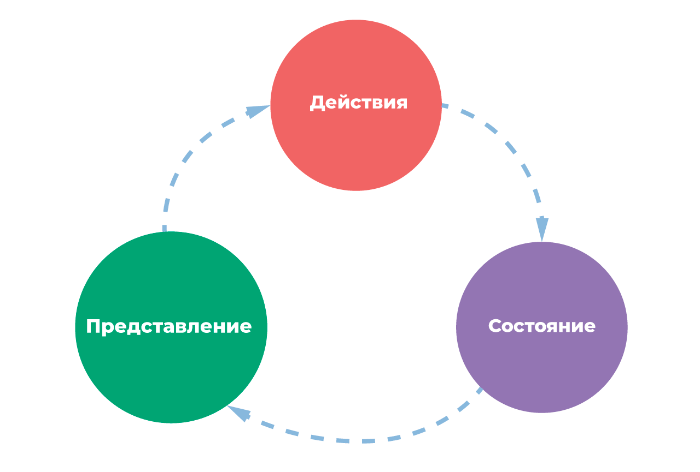

### 1. Vuex 101

Современные веб-страницы могут представлять собой как небольшие одностраничные, так и
крупные многостраничные приложения. Вложенность компонентов в таких приложениях может
достигать десятков элементов. Передача данных между компонентами в таком случае может
стать серьезной проблемой, ведь придется передавать их сквозь большое количество
элементов (без непосредственного использования в них). Данную проблему помогают решить
специальные библиотеки для управления состоянием. Среди них `Redux` (для работы с `React`)
и `Vuex` (для работы с `Vue`)

Библиотека `Vuex` позволяет определить в Вашем приложении общее состояние (хранилище
данных), являющееся "единственным источником правды" во всем приложении. В нем могут
быть (желательно) заложены все необходимые для работы приложения данные. Доступ к этим
данным можно получить в любой точке приложения (в любом компоненте). Это позволяет
избежать использования многократной передачи данных между компонентами с
помощью `props/emit`. Приложение в целом становится более четко структурированным,
поддерживаемым и расширяемым, что ускоряет разработку, снижает время на отладку и
устранение багов, а также добавление новых функций.

Разумеется, использование `Vuex` опционально и не всегда уместно. Библиотека добавляет
новый слой абстракций в приложение, поэтому использовать ее для очень маленьких приложений
нецелесообразно. Впрочем, определить, нужен ли `Vuex` Вашему приложению несложно - если
передача каких-либо данных сопряжена с пробросом их через множество компонентов, `Vuex` -
для Вас.

***

### 2. MVC in Vuex

Центральная идея работы `Vuex` - использование концепции `MVC` для определения логики
работы всего приложения.



В приложении выделяются слои `Model`, `View` и `Controller` (более подробно об `MVC`
см. `Lesson 6`). Благодаря такому разделению данные в приложении перемещаются более
предсказуемо.

`Vuex` однако использует концепцию `MVC`, разделяя слой `Controller` на два подслоя -
действия (`actions`) и мутации (`mutations`). <br>
Посмотрим на схему движения данных во `Vuex` и разберем ее:


1. В компоненте происходят какие-то изменения, после которых необходимо обновить
   глобальное состояние. Компонент вызывает `action`. Действия во `Vuex` асинхронны. <br>
   Сделано это вот почему: в `actions` могут происходить асинхронные операции (такие, как
   запрос на сервер), поэтому при одновременном вызове нескольких действий желательно "не
   морозить" остальной код. Поэтому разработчики `Vuex` сделали `actions` асинхронной
   операцией
2. В `action` выполняются разные операции - например, блокировка кнопок, отправка запросов
   на сервер, разблокировка в момент получения ответа на отправленный запрос. В процессе
   своей работы `action` вызывает определенные мутации, каждая из которых ответственна за
   что-то одно - состояние кнопки, массив каких-либо ключей в состоянии, видимость
   уведомления об ошибке etc. Мутации выполняют синхронные операции по обновлению
   состояния, поэтому сами мутации также работают синхронно.
3. При вызове мутации происходит обновление состояния приложения, которое автоматически
   приводит к получению компонентами обновленных данных. Здесь важно то, что данные
   глобального состояния доступны во всем дереве компонентов (и не только, доступ к
   состоянию можно получить и за пределами `Vue`-дерева)

При анализе данной системы движения данных может возникнуть вопрос: **А зачем нам и
действия, и мутации?** Почему нельзя обойтись одной сущностью, которая будет получать
данные с сервера и обновлять ими состояние? <br>
Данные разделение позволяет выделить в работе новые слои абстракции.
**Действия ответственны за бизнес-логику**. Они делают то, что нужно пользователю -
запрашивают данные для страницы, блокируют кнопки и т.д. В каждом действии может быть
использовано несколько мутаций. Сами **мутации ответственны за низкоуровневое обновление
состояния**. Причем каждая мутация за конкретный ключ в состоянии. <br>
Кроме того, действия, как мы выяснили, асинхронны, а мутации синхронны.
***

### 3. А как, собственно, подключить?

Теперь можно разобраться с внутренним устройством `Vuex`. В директории `./examples`
размещен пример `vuex.html`:

В данном примере будем использовать `Vuex` без сборки (без `webpack`). <br>
Для этого в секцию `head` добавляем скрипт подключения библиотеки:

```
<script src="https://unpkg.com/vuex@2.0.0"></script>
```

Далее нам необходимо настроить наше хранилище:

```
// Вызываем конструктор `new Vuex`
const store = new Vuex.Store({
    // Описываем дефолтное состояние
    state: {
        items: [ 'Один манул', 'Два манула', 'Три манула' ],
    },
    
    // Настраиваем действия
    actions: {
        // payload (с англ. "нагрузка") - данные, которые мы передаем в действие
        // этот аргумент опционален
        addItemAction(context, payload) {
            // вызываем соответствующую мутацию, передаем ей данные
            context.commit('addItem', payload);
        },
        removeItemAction({ commit }, payload) {
            commit('removeItem', payload);
        },
    },
    
    // Настраиваем мутации состояния
    mutations: {
        addItem(state, text) {
            // обновляем состояние
            state.items.push(text);
        },
        removeItem(state, index) {
            state.items.splice(index, 1);
        },
    },
});
```

Теперь в нашем `Vue`-экземпляре мы можем вызвать наши действия и передать им какие-либо
данные:

```
methods: {
    addText() {
        // Обращаемся к состоянию через `this.$store`
        // вызываем метод `dispatch` - отправляем данные
        // первый аргумент - имя действия
        // второй аргумент - передаваемые данные
        this.$store.dispatch('addItemAction', this.newText);
        this.newText = '';
    },
    removeText(index) {
        this.$store.dispatch('removeItemAction', index);
    },
},
```

Отлично. Данные отправлены, состояние обновлено. Теперь нам требуется как-то получить
данные из состояния в нашем экземпляре. Сделать это можно следующим образом:

```
computed: {
    items() {
        // Обращаемся к хранилищу, берем из него нужные данные
        return this.$store.state.items;
    },
},
```

В примере в экземпляре присутствует ключ `newText`, он хранится в конкретном экземпляре,
так как относится только к нему и выносить его во `Vuex` нецелесообразно.
***

### 4. Getters

**Все нижеописанные методы представлены в `./examples/getters-and-map.html`.**

Выше, чтобы получить доступ к элементу состояния `Vuex`, мы использовали конструкцию

```
computed: {
    items() {
        return this.$store.state.items;
    },
},
```

Однако есть и другой способ - описание в хранилище **геттеров** - методов, возвращающих
какую-то часть состояния. <br> Геттеры могут возвращать значение, а могут функцию (удобно
при выделении данных из состояния по какому-то критерию).

Описываются геттеры в специальной секции `getters`:

```
getters: {
    // Геттер для получения конкретных данных
    getUserOlderThen30: (state) => state.users.filter(({ age }) => age > 30),
    
    // Геттер для получения данных по какому-то переданному критерию
    getUsersByAge: (state) => (currentAge) => state.users.filter(({ age }) => age === currentAge),
},
```

Использовать в компоненте их можно через `this.$store`:

```
computed: {
    userOlderThen30 () {
        return this.$store.getters.getUserOlderThen30;
    }
    usersByAge () {
        return this.$store.getters.getUsersByAge(22);
    },
}
```

Настроенные в хранилище геттеры позволяют определять логику выделения из состояния
определенных данных непосредственно в самом хранилище (не нужно продумывать этот момент в
конкретных компонентах).
***

### 5. Вспомогательные методы

При небольшом количестве действий/мутаций/геттеров/элементов состояния
использование `this.$store...` уместно, однако при большом количестве данных в состоянии
повсеместное использование полной формы записи ухудшает читаемость кода. Для решения этой
проблемы были придуманы вспомогательные методы для работы с `Vuex` (данные методы, правда,
являются просто синтаксическим сахаром над уже описанным функционалом).

#### 5.1 mapState

Удобный способ описания данных из хранилища `Vuex` в конкретном компоненте.

```
// В html:
computed: Vuex.mapState({
    users: state => state.users,
    
    // запись данные в ключ с другим именем
    currentUsers: 'users',
    // это корокая запись для:
    currentUsers: state => state.users,
    
    // можно так же добавить в полученный ключ какие-то данные из компонента:
    allUsers(state) {
        return [ ...state.users, ...this.users ];
    }
}),

// В сборке через `webpack`:
// import { mapState } from 'vuex';
```

Есть и более короткая запись для случаев, когда данные нужны именно под теми ключами, что
они лежат в хранилище:

```
computed: mapState([ 'users' ]);

// Теперь данные доступны через `this.users`
```

При необходимости использовать в компоненте другие вычисляемые свойства можно использовать
деструктуризацию объекта `mapState`:

```
computed: {
    ...mapState([ 'users' ]),
    otherComputedProperty() {
        return 'something';
    }
},
```

#### 5.2 mapActions

Удобный способ описания действий (`actions`) в конкретном компоненте.

```
// В html:
methods: {
    ...Vuex.mapActions([ 'addUser' ]),
    // Действие доступно в компоненте через `this.addUser(someData)`
    
    // Назначение псевдонима для действий
    ...Vuex.mapActions({
        // вызов `this.add(someData)` будет аналогичен `this.$store.dispatch('addUser', someData)`
        add: 'addUser',
    }),
}

// В сборке через `webpack`:
// import { mapActions } from 'vuex';
```

#### 5.3 mapGetters

Удобный способ описания геттеров (`getters`) в конкретном компоненте.

```
// В html:
// Подмешиваем геттеры к вычисляемым свойствам компонента (аналогично mapState)
computed: {
    ...Vuex.mapGetters([ 'getUserOlderThen30', 'getUsersByAge' ]),
    // Действия доступны в компоненте через `this.getUserOlderThen30`
    // и `this.getUsersByAge(22)` - здесь 22 - payload - полезная нагрузка
}

// В сборке через `webpack`:
// import { mapGetters } from 'vuex';
```

#### 5.4 mapMutations

Несмотря на то, что при работе через `Vuex` рекомендуется в большинстве случаем вызывать
мутации только в действиях, иногда может быть полезно вызывать мутацию непосредственно из
компонента. Делать можно с помощью `this.$store.commit('addUser', someData)` или с помощью
вспомогательного метода `mapMutations`:

```
// В html:
methods: {
    ...Vuex.mapMutations([ 'addUser' ]),
    // Действия доступны в компоненте через `this.addUser(someData)`
    // Данный вызов аналогичен `this.$store.commit('addUser', someData)`
    
    // Назначение псевдонима для мутаций
    ...Vuex.mapMutations({
        // вызов `this.add(someData)` будет аналогичен `this.$store.commit('addUser', someData)`
        add: 'addUser',
    }),
}

// В сборке через `webpack`:
// import { mapMutations } from 'vuex';
```

***

### 6. Модули во Vuex

При большом размере приложения хранить все данные в одном месте становится сложно (их
просто очень много). Для выделения разделов внутри состояния `Vuex` предлагает
использовать модульную систему.

Каждый модуль является `js`-объектом, в котором настроены все необходимые составляющие
хранилища данных - само состояние, действия, мутации, геттеры и даже другие подмодули (
вкладывать модули в модули можно бесконечно).

В файле `./examples/modules.html` представлен пример определения модулей.

Структура модулей:

```
const errandsModule = {
    state: () => {},
    actions: {},
    mutations: {},
};

const usersModule = {
    state: () => {},
    actions: {},
    mutations: {},
};
```

Добавление модулей в общее хранилище:

```
const store = new Vuex.Store({
    state: {},
    actions: {},
    mutations: {},
    modules: {
        errands: errandsModule,
        users: usersModule,
    },
});
```

Теперь состояние модулей можно получить следующим образом:

```
this.$store.state.errands;  // состояние первого модуля
this.$store.state.users;    // состояние второго модуля
```

Теперь в действиях и мутациях можно получить доступ как к локальному состоянию модуля, так
и к глобальному корневому состоянию:

```
const errandsModule = {
    actions: {
        getSomething({ state, commit, rootState }) {
            // state - локальное состояние модуля
            // rootState - корневое состояние
        }
    }
};
```

#### Есть нюанс!

Все определенные таким образом действия, мутации и геттеры доступны глобально. Это значит,
что в теории можно создать два геттера с одинаковым именем, что приведет к конфликтам.
Решить эту проблему можно с помощью настройки личного пространства имен:

```
const errandsModule = {
    namespaced: true, // сообщаем `Vuex`, что это модуль с собственным пространством имен
    state: () => {
        data: '',
    },
    actions: {
        someAction() {},
    },
    mutations: {
        someMutation() {},
    },
    getters: {
        someGetter() {},
    },
};
```

Теперь доступ к действиям, мутациям и геттерам можно получить следующим образом:

```
someAction через this.$store.dispatch('errandsModule/someAction')
someMutation через this.$store.commit('errandsModule/someMutation')
someGetter через this.$store.getters['errandsModule/someGetter']
```

Теперь разберем, как будут выглядеть вспомогательные функции в случае использования
собственного пространства имен

```
computed: {
    ...mapState({
        data: state => state.errandsModule.data,
    }),
    ...mapGetters([
        'errandsModule/someGetter', // использовать в компоненте как this['errandsModule/someGetter']
    ])
},
methods: {
    ...mapActions([
        'errandsModule/someAction', // использовать в компоненте как this['errandsModule/someAction']()
    ])
}
```

Использовать `actions` в стиле `this['errandsModule/someAction']()` неудобно, поэтому
можно во вспомогательную функцию первым параметром передать путь до вложенного модуля:

```
computed: {
    ...mapState('errandsModule', {
        data: state => state.data,
    }),
    ...mapGetters('errandsModule', [
        'someGetter',
    ])
},
methods: {
    ...mapActions('errandsModule', [
        'someAction',
    ])
}
```

Теперь действия доступы в привычной удобной форме: `this.someAction()`

#### createNameSpaces [самостоятельное изучение]

Предыдущий вариант можно упростить еще больше с помощью вспомогательного
метода `createNamespacedHelpers`:

```
import { createNamespacedHelpers } from 'vuex';
const { mapState, mapActions, mapGetters } = createNamespacedHelpers('errandsModule');

export default {
    computed: {
        ...mapState({
            data: state => state.data,
        }),
        ...mapGetters([
            'someGetter',
        ])
    },
    methods: {
        ...mapActions(['someAction'])
    }
};
```

Вызывать действия/геттеры можно аналогично - `this.someAction()`. Теперь это действие
указывает на `this.$store.dispatch('errandsModule/someAction')`.

***

### 7. Архитектура приложения с использованием Vuex

Как мы выяснили на предыдущем занятии, подключить `Vuex`-хранилище можно в виде одной
сущности, описав в ней дефолтное состояние, действия, мутации и геттеры.

```
const store = new Vuex.Store({
    state: {},
    actions: {},
    mutations: {},
    getters: {},
});
```

Но при большом количестве ключей для хранения, действий и мутаций данный файл разрастется
в нечто очень страшное. Такой код будет тяжело анализировать, поддерживать и
дополнять. <br>
Поэтому для разработки больших приложений с использованием `Vuex` используется
**распределенная архитектура**. <br>
Смысл заключается в том, чтобы разместить основные функциональные блоки состояния по своим
директориям. Для этого необходимо разделить корневые действия и мутации, а также
самостоятельные модули по отдельным файлам:

```
├── index.html                  > html-основа приложения
├── main.js                     > файл создания и монтирования приложения
├── App.vue                     > точка входа во Vue
├── api
│   └── index.js                > блок для работы с API
├── components
│   ├── SomeComponent.vue       > компоненты
│   └── ...
└── store
    ├── index.js                > корневой файл с описанием модулей и ссылками на них
    ├── actions.js              > корневые действия
    ├── mutations.js            > корневые мутации
    └── modules
        ├── moduleOne           > первый модуль
        │   └── index.js        > корневой файл с описанием действий/мутаций модуля
        └── moduleOne           > второй модуль
            └── index.js        > корневой файл с описанием действий/мутаций модуля
```

Пример разработки архитектурного решения см. `./examples/architecture/`.

### 8. Удобная работа с v-model во Vuex [самостоятельное изучение]

Директива `v-model` - удобный способ реактивной передачи данных между шаблоном и
состоянием компонента. Ее также можно использовать и в случае разработки приложения
через `Vuex`. Однако напрямую соединять элемент в шаблоне с состоянием не рекомендуется,
так как в таком случае мы обновляем состояние в обход мутаций. Более того, в строгом
режиме данная конструкция просто вызовет ошибку. <br>
Тем не менее воспользоваться `v-model` все же можно:

```
<input :value="name" @input="onInputName">

...

computed: {
    ...mapState({
        name: state => state.name
    })
},
methods: {
    onInputName (e) {
        this.$store.commit('changeName', e.target.value);
    }
}
```

Данные для поля ввода получаются с помощью `mapState`, а при вводе текста уходят в
состояние через мутацию `changeName`:

```
this.$store.commit('changeName', e.target.value);
```

Однако есть и более лаконичный способ - геттеры/сеттеры `computed`-свойств:

```
<input v-model="name">

...

computed: {
    message: {
        // Получаем свойство
        get () {
            return this.$store.state.name;
        },
        // Устанавливаем свойство во `Vuex` (напрямую через мутацию)
        set (value) {
            this.$store.commit('changeName', value);
        }
    }
}
```

***

### 9. Плагины [самостоятельное изучение]

`Vuex` предлагает разработчику возможность отслеживать выполнение мутаций состояния. Для
этого необходимо определить плагин и подключить его к текущему объекту состояния:

Плагин - функция, принимающая в качестве аргумента текущее состояние приложения и
инициализирующая слежение за выполнением мутаций. Таким образом, мы можем выполнять
какую-либо логику непосредственно после обновления состояния:

```
const watchUsersPlugin = (store) => {
    // "Подписываемся" на срабатывание мутаций
    store.subscribe((mutation, state) => {
        // Данная функция выполнился после каждой мутации.
        // Мутация передаётся в формате `{ type, payload }`.
        if (mutation.type === 'ADD_USER') {
            console.log('Пользователь добавлен');
        }
    });
};

const store = new Vuex.Store({
    state: { ... },
    actions: { ... },
    mutations: { ... },
    // Добавляем плагин в объект состояния
    plugins: [watchUsersPlugin]
});
```

***

### 10. Vuex Persist

При работе с системами хранения данных на клиентской части приложения (`Vuex`, `Redux`)
возникает одна неприятная проблема - при перезагрузке окна в браузере состояние (в нашем
случае `Vuex`) сбрасывается. Таким образом, если Вам требуется сохранить состояние фильтра
при перезагрузке страницы, нужно придумывать окольные пути решения проблемы. Одним из
возможных путей является использование `localStorage` в качестве место для хранения
ключей.

Однако есть и более удобные способы. <br>
Например, библиотеки-персисторы (`persist` - "сопротивляться/сохраняться").

Для `Vuex` это:

- **[vuex-persist](https://github.com/championswimmer/vuex-persist)** <br>
  Данная библиотека самостоятельно сохраняет данные в браузере/на компьютере пользователя.
  Для этого необходимо произвести несложную настройку:

```
// Устанавливаем библиотеку как зависимость
yarn add vuex-persist
```

```
import Vue from 'vue';
import Vuex from 'vuex';

// Импортируем библиотеку
import VuexPersistence from 'vuex-persist';

Vue.use(Vuex)

export default new Vuex.Store({
    state: { ... },
    mutations: { ... },
    actions: { ... },
    // Добавляем библиотеку как плагин
    plugins: [new VuexPersistence().plugin]
})
```

- **[vuex-persistedstate](https://www.npmjs.com/package/vuex-persistedstate)** <br>

```
import Vue from 'vue';
import Vuex from 'vuex';

// Импортируем библиотеку
import createPersistedState from 'vuex-persistedstate';

Vue.use(Vuex);

export default new Vuex.Store({
    modules,
    plugins: [createPersistedState()],
});
```

***

### 11. Vue/Vuex Hot Reloading

Фреймворк `Vue.js` сам по себе является высокоуровневой абстракцией и значительно
ускоряет/упрощает разработку клиентской части приложения. Однако даже при использовании
фреймворка могут возникать различные сложности. Так, при обновлении кода для отображения
изменений приходится обновлять страницу. Это неудобно тем, что:

- все всплывающие/модальные окна автоматически сбрасываются
- текущее состояние в отдельных компонентах тоже сбрасывается
- любое изменение в `CSS` повлечет необходимость полной перезагрузки страницы

Конечно, есть библиотеки, которые будут автоматически обновлять страницу каждый раз, когда
изменится файл сборки. Это ускоряет работу, но основная часть минусов никуда не уходит.

Для фундаментального решения данной проблемы была придумана "система горячей
перезагрузки" (**Hot Module Replacement (HMR)**). Она позволяет точечно обновлять `DOM`
-дерево при обновлении файла сборки.

#### HMR для Vue

Доступно при использовании [vue-loader](https://vue-loader.vuejs.org/) (используется для
компиляции однофайловых компонентов в общий файл сборки).

Если проект настроен через `vue-cli`, "горячая перезагрузка" работает "из коробки". Если
проект настраивается своими силами, необходимо запустить дев-сервер:

```
webpack-dev-server --hot
```

При необходимости горячую перезагрузку, разумеется, можно отключить.

#### HMR для Vuex

Доступно при
использовании [Webpack HMR Tip](https://webpack.js.org/guides/hot-module-replacement/)
. <br>
Необходимо настроить конфигурацию для работы в режиме **HMR**, после чего можно
скорректировать работу `Vuex` в проекте:

```
// store.js
import Vue from 'vue';
import Vuex from 'vuex';
import mutations from './mutations';
import someModule from './modules/someModule';

Vue.use(Vuex);

const store = new Vuex.Store({
    state: {},
    mutations,
    modules: {
        someModule: someModule
    }
})

if (module.hot) {
    // рассматриваем действия и мутации как модули для горячей перезагрузки
    module.hot.accept(['./mutations', './modules/someModule'], () => {
    
        // получаем обновленные модули
        const newMutations = require('./mutations').default;
        const newSomeModule = require('./modules/someModule').default;
        
        // замена модулей и мутаций
        store.hotUpdate({
            mutations: newMutations,
            modules: {
                someModule: newSomeModule
            }
        })
    })
}
```
