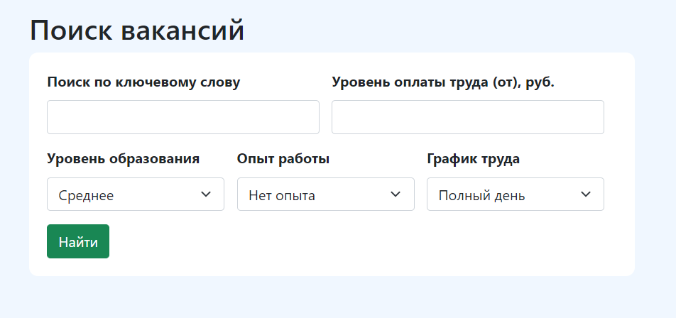
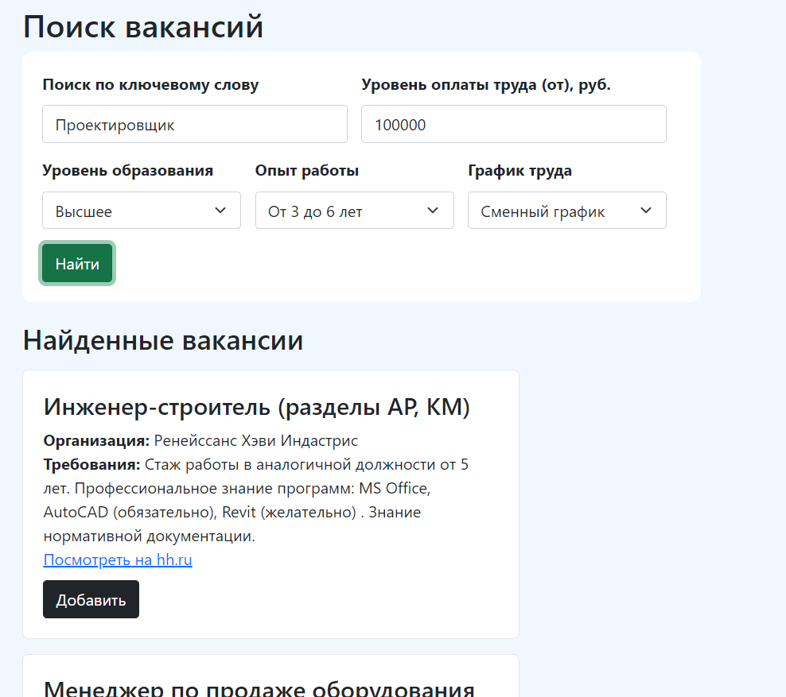
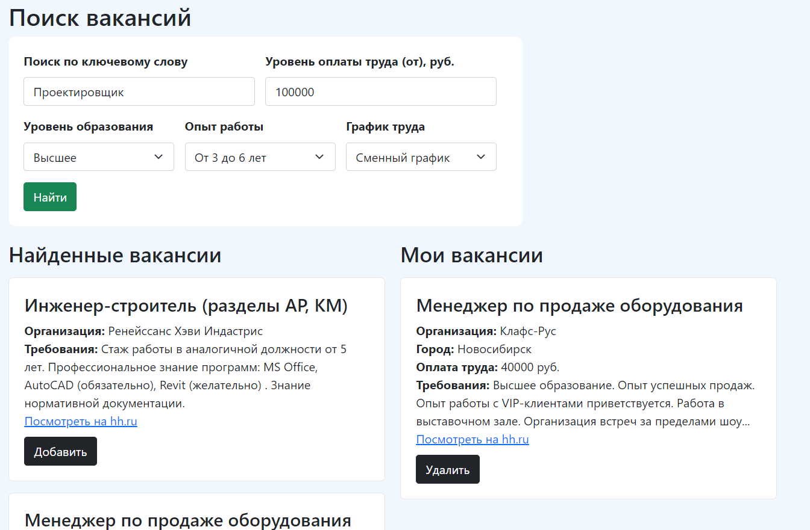

### Head Hunter

В данном задании необходимо реализовать приложение для поиска вакансий на **hh.ru**.

### Отображение

Изначально на странице располагается только фильтр. Он имеет следующий внешний вид:



После ввода каких-либо опций в фильтре и нажатии на кнопку "Найти" под фильтром появляется
блок "Найденные вакансии":



При нажатии на кнопку "Добавить" в карточке вакансии, она добавляется в правый блок -
раздел "Мои вакансии":



При нажатии на кнопку "Удалить" в добавленной карточке, вакансия из блока "Мои вакансии"
удаляется

### Задачи

1. Реализуйте компонент `./HeadHunter.vue`. <br>
   В нем необходимо использовать компоненты `./components/SearchFilter.vue`
   и `./components/Vacancies.vue`;
2. Компонент `./components/itisSelect.vue` реализован. Его можно использовать для
   отображения селектов в фильтре. Внимательно изучите его строение перед использованием;
3. Реализуйте компонент `./components/SearchFilter.vue`. <br>
   Здесь необходимо сверстать фильтр для поиска по вакансиям. Поля для поиска следующие:

|              Поле               | Элемент в `DOM` |           Опции           | Параметр в запросе |
|:-------------------------------:|:---------------:|:-------------------------:|:------------------:|
|    Поиск по ключевому слову     |    `input`      |            -              |      `text`        |
| Уровень оплаты труда (от), руб. |     `input`     |             -             |      `salary`      |
|       Уровень образования       |    `select`     | `EDUCATION_LEVEL_OPTIONS` | `education_level`  |
|           Опыт работы           |    `select`     | `EDUCATION_LEVEL_OPTIONS` |    `experience`    |
|          График труда           |    `select`     |    `SCHEDULE_OPTIONS`     |     `schedule`     |

Для селектов желательно использовать компонент `itisSelect`. <br>

Компонент должен осуществлять поиск по вакансиям и отправлять полученные вакансии
во `Vuex` с помощью соответствующих действий (`actions`).

При нажатии на кнопку "Найти" должен отправляться запрос
на `url=https://api.hh.ru/vacancies?<params>`, где `params` - параметры поиска.

Пример
запроса: `https://api.hh.ru/vacancies?text=Конструктор&education_level=master&experience=between3And6&schedule=flexible&salary=100000`

4. Реализуйте компонент `./components/Vacancies.vue`. <br>
   Здесь необходимо создать верстку для карточки вакансий. Причем для двух вариантов - для
   карточек из разделов "Все вакансии" и "Мои вакансии" (различие в тексте кнопки и в
   действии, которое она производит, остальное идентично). <br>
   В карточке выводим следующие поля:

| Поле | Ключ в объекте вакансии |
| ---- | ---- |
| Наименование вакансии | `name` |
| Организация | `employer` |
| Город | `address` |
| Оплата труда | `salary.from` |
| Требования | `snippet.requirement` |
| Посмотреть на hh.ru <br> (ссылка, ведущая на страницу вакансии на `hh.ru`) | `alternate_url` |

5. Доработайте файл `./store/index.js` - хранилище `Vuex`. <br>
   Здесь необходимо разработать все составляющие хранилища - `state`, `actions`
   и `mitations`

Фильтр может иметь следующую структуру:

```
<div class="filter">
    <div class="filter__block">
        <div>
            <b>Поиск по ключевому слову</b>
            <input class="form-control">
        </div>
        <div>
            <b>Уровень оплаты труда (от), руб.</b>
            <input class="form-control">
        </div>
    </div>
    <div class="filter__block">
        <div>
            <b>Уровень образования</b>
            <select
                class="form-select"
                value=""
            >
                <option value="secondary">
                    Среднее
                </option>

                ...other options
            </select>
        </div>
        <div>
            <b>Опыт работы</b>
            <select class="form-select" value="">
                <option value="noExperience">
                    Нет опыта
                </option>

                ...other options
            </select>
        </div>
        <div>
            <b>График труда</b>
            <select
                class="form-select"
                value=""
            >
                <option value="fullDay">
                    Полный день
                </option>

                ...other options
            </select>
        </div>
    </div>
    <button class="btn btn-success">
        Найти
    </button>
</div>
```

Блок с вакансией может иметь следующую структуру:

```
<div class="vacancies__item">
    <h4>Инженер</h4>
    <div>
        <b>Организация:</b> Стафф Рекрутинг
    </div>
    <div>
        <b>Оплата труда:</b> 100000 руб.
    </div>
    <div>
        <b>Требования:</b> Знание нормативной документации, умение читать
        чертежи. - Уверенное владение программами для черчения и моделирования
        конструкций (AutoCAD, SCAD, текла).
    </div>
    <a href="https://hh.ru/vacancy/49370267">
        Посмотреть на hh.ru
    </a>
    <button class="btn btn-dark">
        Добавить <!-- Для блока "Мои вакансии" - текст "Удалить"-->
    </button>
</div>
```

### Тестирование

В данном задании нет привычного файла с тестами. Решение будет проверяться менторами
вручную.

### Важно

Решение должно быть реализовано через `Vuex`

### Дополнительно

1. Стили для отображения определены

### Где и как посмотреть

1. Из корня проекта запускаем сборку `vue` через `webpack` - `yarn watch`
2. Для визуального отслеживания изменений необходимо открыть в браузере
   файл `./index.html`