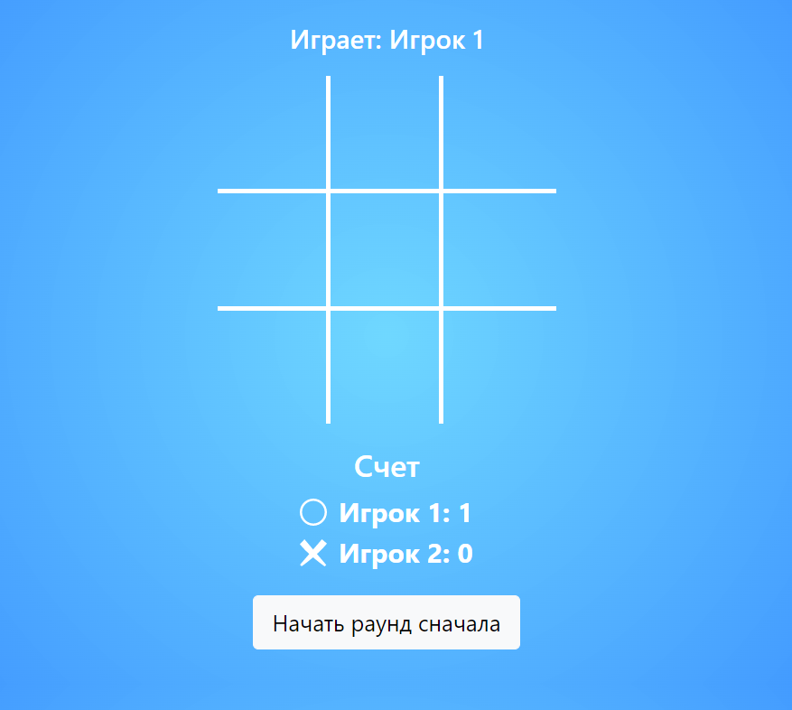

### Игра "Крестики-нолики"

В данном задании необходимо с помощью `Vuex` реализовать игру "Крестики-нолики".

**Данная задача имеет повышенный уровень сложности, поэтому за ее решение ставится 1
дополнительный балл (в общий зачет семестра)**

### Отображение

Интерфейс игры очень простой. Игра ведется на поле 3x3. Над полем располагается информация
о том, какой игрок на данный момент играет. Под полем общий счет игр и кнопка "Начать
раунд сначала".


После каждого хода происходит проверка завершения раунда. Если кто-то из игроков одержал
победу, появляется уведомление "Игрок 1 (или 2) одержал победу".


После чего счет под игровым полем обновляется, само поле очищается.



### Задачи

1. Реализуйте компонент `TicTacToe.vue`. Определите в нем логику отображения игрового поля
   и вспомогательной информации. <br>
   Так, например, для вывода в конкретной ячейке крестика или нолика нужно в
   элемент `.tic-tac-toe__item` добавить соответствующий `svg` (иконки лежат в
   директории `./icons`)

`DOM`-дерево в определенный момент игры может иметь следующую структуру:

```
<div class="tic-tac-toe">
    <h4>Играет: Игрок 1</h4>
    <div class="tic-tac-toe__table">
        <div class="tic-tac-toe__row">
            <div class="tic-tac-toe__item">
                <svg> <!-- иконка --> </svg>
            </div>
            <div class="tic-tac-toe__item"></div>
            <div class="tic-tac-toe__item">
                <svg> <!-- иконка --> </svg>
            </div>
        </div>
        <div class="tic-tac-toe__row">
            <div class="tic-tac-toe__item"></div>
            <div class="tic-tac-toe__item">
                <svg> <!-- иконка --> </svg>
            </div>
            <div class="tic-tac-toe__item"></div>
        </div>
        <div class="tic-tac-toe__row">
            <div class="tic-tac-toe__item">
                <svg> <!-- иконка --> </svg>
            </div>
            <div class="tic-tac-toe__item"></div>
            <div class="tic-tac-toe__item"></div>
        </div>
    </div>
    <div class="tic-tac-toe__results">
        <h3>Счет</h3>
        <div>
            <svg> <!-- иконка --> </svg>
            Игрок 1: 0
        </div>
        <div>
            <svg> <!-- иконка --> </svg>
            Игрок 2: 0
        </div>
    </div>
    <button class="btn btn-light btn-lg">
        Начать раунд сначала
    </button>
</div>
```

2. Реализуйте хранение данных приложения в двух модулях:
    * Модуль `gameTable.js` - хранение текущего состояния игрового поля и размера
      поля (`fieldSize`), а также всех соответствующих действий/мутаций/геттеров
    * Модуль `statistics.js` - хранение информации об игроках и индекса играющего в данный
      момент участника, а также всех соответствующих действий/мутаций/геттеров

Поля в модулях могут быть изменены. Главное, чтобы количество модулей в решении было не
меньше двух.

3. Импортируйте модули в файле `./store/index.js`

### Тестирование

В данном задании нет привычного файла с тестами. Решение будет проверяться менторами
вручную.

### Важно

Решение должно быть реализовано через модульную систему во `Vuex`.

### Дополнительно

1. Стили для отображения определены (можно корректировать по своему усмотрению)

### Где и как посмотреть

1. Из корня проекта запускаем сборку `vue` через `webpack` - `yarn watch`
2. Для визуального отслеживания изменений необходимо открыть в браузере
   файл `./index.html`