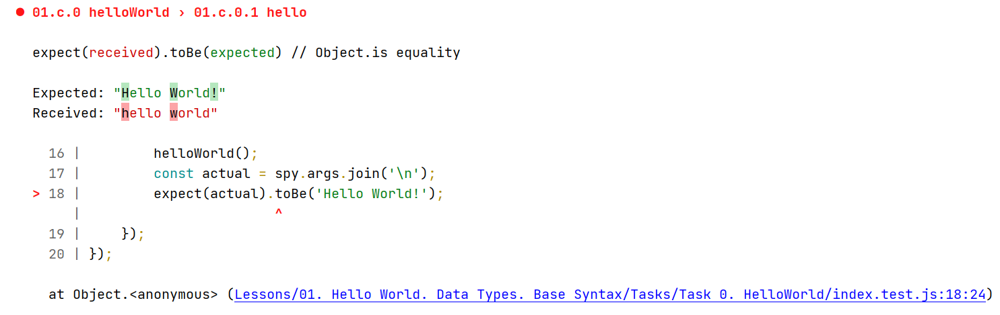
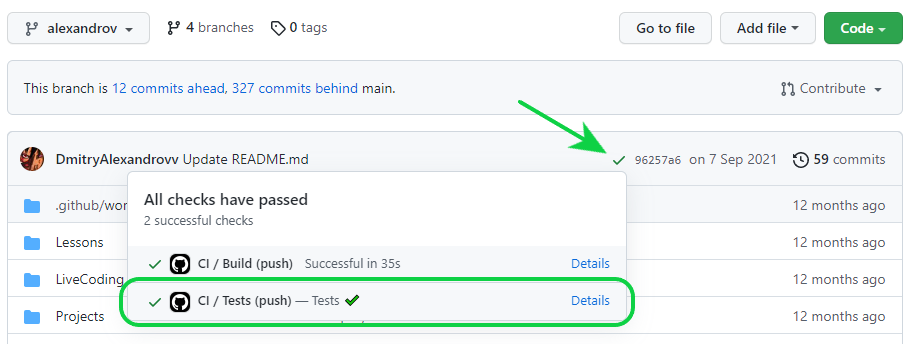
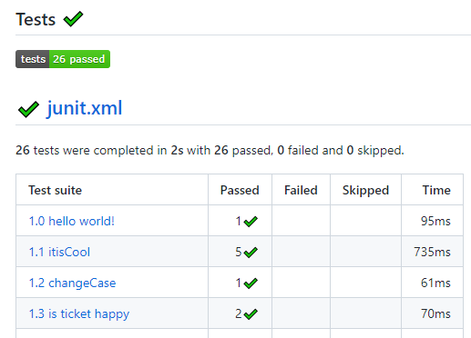

## Работа с тестами

**Большинство задач в курсе имеют встроенную систему тестирования. При проверке ДЗ менторы
в первую очередь обращают внимание именно на тесты.**

В репозитории для тестирования используется библиотека **[Jest](https://jestjs.io/)**

### Как запустить

- запуск всех тестов

```
yarn test
```

- запуск тестов для измененных файлов (`uncommitted` файлы)

```
yarn test-i
```

- запуск тестов в режиме `watch` - автоматический перезапуск тестов при изменениях в
  файлах (**предпочтительный вариант**)

```
yarn test-watch
```

Также можно запускать тесты для отдельных задач:

- запуск тестов для задач из классной работы

```
// 01 - номер занятия, 3 - номер задания, c - classwork
yarn test 01.c.3
```

- запуск тестов для задач из домашней работы

```
// 01 - номер занятия, 3 - номер задания, h - homework
yarn test 01.h.3
```

Также тесты для конкретных задач можно запускать в `watch`-режиме:

```
// classwork
yarn test-watch 01.c.3

// homework
yarn test-watch 01.h.3
```

### Где найти результаты прохождения тестов

1. Консоль <br>

При запуске `jest` выводит в консоль полный отчет о прохождении тестов:



Здесь представлена следующая информация:

- В чем заключается ошибка (если она есть)
- Сравнение ожидаемого и полученного результатов
- Точное место в тесте, где произошла ошибка
- Stacktrace - последовательность вызова функций - по этому блоку можно проследить, какой
  именно код "упал" и какие методы были затронуты в момент падения

2. Отображение в вебе

После того как Ваш код будет залит в репозиторий в `Github`, произойдет автоматический
запуск тестов в Вашей ветке. Найти отчет о прохождении тестов можно так:

- Перейти в свою ветку (селектор в верхнем левом углу)
- Нажать на галочку (крестик) в строке с информацией о коммитах
- В открывшемся окне перейти по ссылке `Details`



Здесь Вы сможете найти полноценный отчет о прохождении всех тестов в Вашей ветке:

